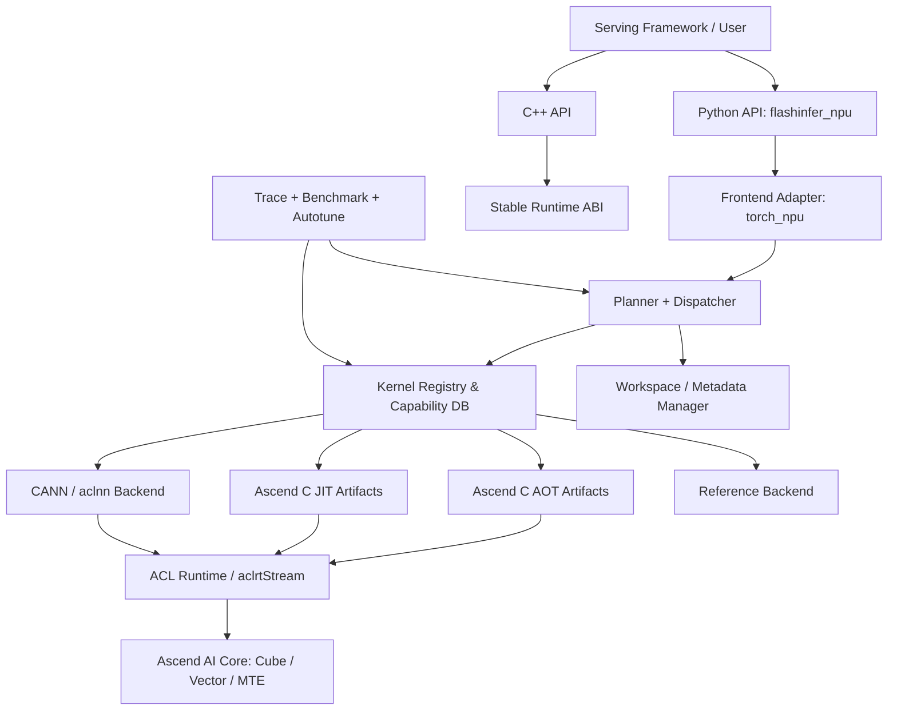
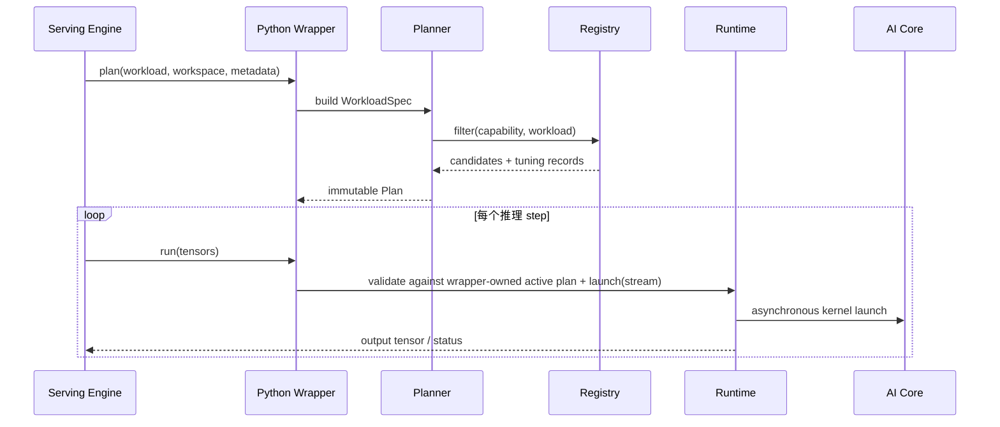
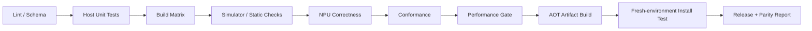

# FlashInfer-NPU 总体架构设计

> 文档状态：Architecture draft v0.1
> 项目名：`flashinfer-npu`；Python 包名：`flashinfer_npu`
>
> 仓库范围：当前只建设 Attention 框架层，不包含 NPU kernel 实现，也不把
> Host 合同解释为可用的 Ascend 算子。GEMM、MoE、sampling 等其他能力域不在
> 本阶段范围。Attention 细化设计见
> `docs/attention_framework.md`。

## 1. 摘要

FlashInfer-NPU 是面向昇腾推理场景的高性能算子库与内核生成系统。项目在能力域、API 语义、`plan/run` 生命周期、JIT/AOT 交付、测试和基准方法上对标 FlashInfer；在实现上针对 Ascend AI Core、CANN、Ascend C、ACL Runtime 和 `torch_npu` 重新设计，不逐行翻译 CUDA 内核。

首期重点是量化大模型推理：量化 GEMM、量化 KV Cache、prefill/decode attention、MLA、MoE 以及与这些主路径相邻的融合算子。长期目标覆盖 FlashInfer 的全部稳定能力域，并为 vLLM、SGLang 等服务框架提供低侵入适配。

本设计的核心结论是：

1. 公共 API 与底层实现解耦。Python API 尽量保持 FlashInfer 的名称、参数、布局和行为语义，内核只依赖框架无关的张量视图、设备指针、workspace、tiling metadata 和 `aclrtStream`。
2. 所有复杂算子统一采用 `plan()` / `run()`。Host 侧规划、kernel 选择、workspace 计算和 metadata 生成不进入热路径；`run()` 不做隐式 Host 同步和临时内存分配。
3. 统一后端注册与选择。Ascend C AOT、Ascend C JIT、CANN/aclnn 组合实现和 reference 实现共享同一套 capability/registry/dispatch 协议。
4. 量化格式是一等公民。scale、zero point、分组方式和物理排布必须由版本化的 `QuantSpec` 描述，不能依靠调用者与内核之间的隐含约定。
5. 开发期允许 JIT，生产默认 AOT。缓存键同时覆盖源码、编译参数、SoC、CANN、`torch_npu` ABI 和算子特化参数，避免错误复用二进制。
6. “完全对标”以可追踪的 parity manifest 衡量，而不是一次性里程碑。稳定 API、实验 API和 NVIDIA 专有实现必须分开处理。

## 2. 背景与依据

FlashInfer 当前定位是 LLM serving 的 kernel library 与 kernel generator，能力覆盖 attention、GEMM、MoE、sampling、通信和常用融合算子，并提供多后端选择、低精度计算、JIT/AOT artifact 和面向服务框架的统一 API。其源码采用 Python API、JIT/codegen、框架绑定、框架无关 kernel template 的分层方式；复杂 attention wrapper 采用 reusable workspace 和 `plan/run` 生命周期。

昇腾侧的关键差异是：

- AI Core 由 Cube、Vector、Scalar 计算单元以及 L0/L1/Unified Buffer 等存储层次组成，数据搬运、对齐和 Cube/Vector 流水对性能影响显著。
- Ascend C 支持 Vector、Cube 以及 Cube/Vector 融合算子编程范式；内核启动通过 ACL Runtime stream 异步下发。
- CANN 同时存在单算子、图模式、内置算子和自定义算子路径；`torch_npu` 是 PyTorch 首选接入层，但不应成为内核模板层的依赖。
- 不同 SoC 与 CANN 版本的 dtype、指令和高阶 API 能力差异明显，因此不能用单一全局版本判断替代运行时 capability。

参考资料：

- [FlashInfer 项目主页与能力列表](https://github.com/flashinfer-ai/flashinfer)
- [FlashInfer 当前源码分层说明](https://github.com/flashinfer-ai/flashinfer/blob/main/CLAUDE.md)
- [FlashInfer Attention API](https://docs.flashinfer.ai/api/attention.html)
- [FlashInfer Quantization API](https://docs.flashinfer.ai/api/quantization.html)
- [昇腾 AI Core 计算单元](https://www.hiascend.com/document/detail/en/canncommercial/800/opdevg/Ascendcopdevg/atlas_ascendc_10_0009.html)
- [Ascend C Kernel Launch](https://www.hiascend.com/document/detail/en/canncommercial/800/opdevg/Ascendcopdevg/atlas_ascendc_10_0052.html)
- [CANN 图模式与单算子模式](https://www.hiascend.com/document/detail/en/canncommercial/800/graph/graphguide/atlasgraphug_24_0001.html)
- [msProf 算子性能分析](https://www.hiascend.com/document/detail/en/canncommercial/800/devaids/optool/atlasopdev_16_0082.html)

## 3. 目标、非目标与对标口径

### 3.1 目标

- 对齐 FlashInfer 稳定 API 的能力域和核心语义，降低 CUDA serving stack 迁移到 NPU 的适配成本。
- 在目标昇腾 SoC 上提供性能可预测、可调优、可复现的低延迟推理算子。
- 优先建立 W8A8、W8A16、W4A16、量化 KV Cache 等推理链路；实际支持组合由 capability matrix 决定。
- 同时支持连续 batching、paged/ragged KV Cache、prefill、decode、混合 batch、MLA 和 MoE。
- 保持 kernel 层框架无关，首个正式 frontend 为 PyTorch + `torch_npu`，后续可接 C++、MindSpore 或其他 runtime。
- 提供完整的 correctness、benchmark、profiling、trace、autotuning 和 artifact 管理基础设施。
- 允许下游服务框架固定 workspace、复用 plan、复用 stream，并适配图捕获或图模式所要求的静态资源。

### 3.2 非目标

- 不保证 CUDA/NPU 二进制兼容，也不模拟 CUDA runtime。
- 不在首期承担完整的模型量化、校准、训练感知量化或 checkpoint 转换平台；库提供格式转换工具和清晰的权重/KV 格式契约。
- 不承诺所有 FlashInfer 实验 API 立即可用；实验 API 进入 parity registry，但不阻塞首个稳定版本。
- 不复制 TensorRT-LLM、cuDNN、CUTLASS、NVSHMEM 等 NVIDIA 专属后端名称和内部实现。它们对应到昇腾的 backend capability，而不是伪装成原后端。
- 不以单点 microbenchmark 代替端到端 serving 指标。

### 3.3 “完全对标”的定义

对每个 FlashInfer public symbol 维护一条机器可读记录：

```yaml
upstream: flashinfer.prefill.BatchPrefillWithPagedKVCacheWrapper
local: flashinfer_npu.prefill.BatchPrefillWithPagedKVCacheWrapper
upstream_kind: stable
semantic_status: compatible       # exact | compatible | intentionally_different
implementation_status: optimized  # missing | reference | functional | optimized
supported_soc: [ascend910b]
notes: "backend 参数改为 ascendc/aclnn/auto"
```

兼容性分三层：

1. **API 兼容**：名称、参数默认值、shape、dtype、返回值和异常语义。
2. **行为兼容**：KV layout、mask、positional encoding、LSE、determinism、in-place 语义一致。
3. **能力等价**：NVIDIA 专属 backend 被同等用途的 NPU backend 替代；无法等价时明确标记 `intentionally_different`。

发布时生成 API parity 报告。只有稳定 API 达到约定覆盖率且无未解释差异，才允许宣称对应 FlashInfer 版本的兼容级别。

## 4. 能力范围与优先级

| 能力域 | 对标内容 | NPU 侧重点 | 首期优先级 |
| --- | --- | --- | --- |
| Attention | single/batch prefill、decode、paged/ragged、mixed batch | 在线 softmax、GQA/MQA、paged KV | P0 |
| KV Cache | append、page、layout、cascade state merge | INT8/FP8（依 SoC）KV、scale layout | P0 |
| GEMM | dense、batched、grouped、low precision | W8A8、W8A16、W4A16、BF16 | P0 |
| Quantization | quant/dequant、pack、scale layout | 权重、激活、KV Cache 统一 `QuantSpec` | P0 |
| Norm/Activation/RoPE | RMSNorm、fused add、SiLU/GELU、RoPE | norm+quant、RoPE+KV append 融合 | P0 |
| MLA | prefill/decode、paged MLA | DeepSeek 系列主路径 | P1 |
| MoE | routing、grouped GEMM、fused experts | 量化专家、top-k、dispatch/combine | P1 |
| Sampling | top-k、top-p、min-p、speculative | 无排序/分层筛选 | P1 |
| Sparse/Cascade | block sparse、shared-prefix merge | 长上下文与共享前缀 | P2 |
| Communication | all-reduce、all-to-all、attention parallel | HCCL 与通信计算融合 | P2 |
| 其他模型算子 | Mamba、GDN/KDA、diffusion 等 | 按下游需求排序 | P3 |

优先级只决定交付顺序，不改变长期 parity 范围。

## 5. 总体架构



### 5.1 分层职责

#### L0：硬件抽象与 kernel primitives

位置：`include/flashinfer_npu/arch`、`include/flashinfer_npu/primitives`

- SoC capability、数据类型、地址空间、对齐、barrier 与流水抽象。
- GM/L1/L0/UB 搬运、双缓冲/多缓冲、Cube matmul、Vector reduce/softmax、quant/dequant、layout transform 原语。
- 不包含 PyTorch、Python 或业务 API 类型。
- 原语必须允许 SoC 专用实现，不能通过大量运行时分支形成“万能内核”。

#### L1：框架无关算子 kernel

位置：`include/flashinfer_npu/kernels`

- Attention、GEMM、MoE、sampling、norm 等 Ascend C 内核和 launch descriptor。
- 输入为原始 device pointer、POD shape/stride、workspace、tiling metadata、stream。
- Kernel 中不进行动态内存分配，不依赖 framework allocator。
- 算法、tile、pipeline stage、dtype 和 layout 可模板特化。

#### L2：Host launcher 与稳定 ABI

位置：`csrc/runtime`、`csrc/ops`

- 张量参数合法性校验、kernel artifact 加载、function handle 获取、异步 launch、错误码转换。
- 提供稳定 C ABI；C++ wrapper 只作为便利层。
- 维护 `TensorView`、`QuantSpecView`、`WorkspaceView`、`PlanView` 等轻量结构。
- 不在 launch 前后隐式执行 stream synchronize。

#### L3：Planner、registry 与 artifact 系统

位置：`flashinfer_npu/runtime`、`flashinfer_npu/jit`

- 根据 workload、SoC、软件版本和用户 policy 过滤 candidate kernels。
- 计算 workspace、blockDim、tiling 参数和 persistent metadata。
- 查询 AOT/JIT cache，必要时在允许的环境触发 JIT。
- 应用 tuning database 或稳定 cost model，记录最终选择原因。

#### L4：Frontend 与公共 API

位置：`flashinfer_npu/*.py`、`flashinfer_npu/frontend`

- 提供与 FlashInfer 对齐的函数、wrapper class 和 `plan/run` 语义。
- PyTorch frontend 负责 `torch.Tensor` 到框架无关 ABI 的转换、当前 NPU stream 获取和 `torch.library` 注册。
- 公共 API 不直接拼接 CANN 内置算子；所有后端统一通过 dispatcher。

#### L5：集成、工具与质量系统

位置：`integrations`、`benchmarks`、`tests`、`tools`

- vLLM/SGLang 适配、CLI、trace、benchmark、profiling、autotuning。
- 生成 parity、support matrix、性能回归和 artifact manifest。

## 6. 核心对象模型

### 6.1 WorkloadSpec

描述一次调用中会影响 kernel 选择的语义，不携带实际 device data：

```python
@dataclass(frozen=True)
class WorkloadSpec:
    op: str
    dtypes: tuple[DType, ...]
    layouts: tuple[str, ...]
    static_dims: tuple[int, ...]
    dynamic_bounds: tuple[int, ...]
    quant_specs: tuple[QuantSpec, ...]
    causal: bool | None
    pos_encoding: str | None
    deterministic: bool
```

`WorkloadSpec` 必须可序列化、可哈希，是 plan cache、trace 和 benchmark 的共同输入。

### 6.2 DeviceCapability

由运行时探测与构建期 manifest 合并得到：

- SoC family 和具体 revision。
- AI Core 数量、可用 Cube/Vector 能力、相关 memory/alignment 限制。
- 支持的 storage/compute/accumulator dtype。
- CANN、driver、firmware、`torch_npu` 版本与 ABI 标识。
- 图模式、特定高阶 API 和 artifact format 能力。

禁止在业务代码中散落 `if soc == ...`。所有判断写成 registry predicate，并由 support matrix 测试覆盖。

### 6.3 KernelDescriptor

```python
@dataclass(frozen=True)
class KernelDescriptor:
    kernel_id: str
    op: str
    backend: str
    artifact: ArtifactRef
    launch_abi: KernelLaunchABI
    binary_abi: KernelBinaryABI
    capability: CapabilityPredicate
    workspace: WorkspaceFormula       # Attention float workspace
    int_workspace: WorkspaceFormula   # Attention int workspace
    tiling_schema: str
    priority: int
    tuning_keys: tuple[str, ...]
```

Descriptor 来自代码注册或构建生成的 manifest，不允许通过 import side effect 隐式覆盖同名 kernel。
Kernel manifest v3 禁止裸 artifact 路径；非 reference descriptor 必须同时携带带
digest/size/target/build identity 的 `ArtifactRef`、版本化逻辑 `KernelLaunchABI` 和冻结
C primitive/POD/error contract 的 `KernelBinaryABI`。内容与 ABI 规则见
[`attention_kernel_artifact.md`](attention_kernel_artifact.md) 和
[`attention_launcher_abi.md`](attention_launcher_abi.md)。
六种 Attention mode 的 canonical plan payload 见
[`attention_plan_metadata_wire.md`](attention_plan_metadata_wire.md)。

Attention 不能把 float/int workspace 合并成一个总量；两条 formula 分别进入 descriptor
fingerprint、dispatch receipt 和 execution identity validation。

### 6.3.1 Attention dispatch receipt

通用 registry 选择与 Attention capability evidence 之间使用版本化
`AttentionDispatchReceipt` 闭环。Receipt 同时固定 plan/admission/workload、numerics、exact
environment、profile/rule/evidence、kernel descriptor 和 float/int workspace formula。
任何一层变化都必须重新 dispatch；receipt 不能作为无需复核的授权 token。当前 Host 实现只
验证这条选择链，不加载设备 artifact。Receipt 还分别固定 artifact、logical launch ABI 与
binary ABI fingerprint。详见
[`attention_dispatch_receipt.md`](attention_dispatch_receipt.md)。

### 6.4 Plan

Plan 是 host 侧规划结果，包含：

- 选中的 `kernel_id` 和 fallback chain。
- 固定或上界化 float/int workspace 大小与各自对齐。
- Host tiling 结果和需要常驻 NPU 的 metadata tensor。
- 动态 batch 的允许范围和运行时校验条件。
- plan fingerprint、capability fingerprint 和 tuning record id。

Plan 应可复用、可检查、可导出 trace；默认不可变。与 device 绑定的资源由 wrapper 持有，并明确生命周期。

### 6.5 Workspace

- Caller-owned workspace 是默认模式，便于 serving engine 统一规划内存。
- Wrapper 可为易用性持有 workspace，但 `run()` 不得扩容；容量不足应在 `plan()` 阶段发现。
- Host workspace 与 device workspace 分开声明。
- 所有 workspace size API 都必须是纯函数：`get_workspace_size(spec, capability) -> bytes`。
- 需要图捕获/图模式时，workspace 地址和 metadata 地址保持稳定。

## 7. 调用生命周期



规则：

- `plan()` 可以执行 Host 计算、缓存查找和 metadata 上传，但默认不触发数据相关的 NPU-to-Host 读取。
- `run()` 只允许 O(1) Host dispatch、轻量 shape/bounds 校验和异步 launch。
- 动态 shape 超出 plan bound 时明确报错或要求 re-plan，不能静默选择不同 workspace 大小。
- API 在上游兼容位置保留 `backend="auto"`；`reference` 仅是显式 Host oracle。
  `ascendc`、`aclnn`、外部包名和具体 `kernel_id` 属于内部集成/诊断信息，不进入模型侧选择接口。
- 强制 kernel 不可用时给出缺失 capability 和可用候选，不静默降级。

## 8. Attention 与 KV Cache 设计

### 8.1 API 面

首批对齐：

- `single_prefill_with_kv_cache`
- `single_decode_with_kv_cache`
- `BatchPrefillWithPagedKVCacheWrapper`
- `BatchPrefillWithRaggedKVCacheWrapper`
- `BatchDecodeWithPagedKVCacheWrapper`
- `BatchAttention`
- paged KV append、merge state、cascade/shared-prefix 相关 API

参数和 layout 尽量与 FlashInfer 保持一致，包括 `NHD` / `HND`、`indptr`、`indices`、`last_page_len`、GQA/MQA head mapping、causal mask、window、soft cap、RoPE 和 LSE 返回。

### 8.2 统一 metadata

Paged KV Cache 的最小稳定契约：

```text
pages:          physical KV page tensor
kv_indptr:      [batch + 1]
kv_page_indices:[num_pages]
kv_last_page_len:[batch]
qo_indptr:      [batch + 1]，ragged/mixed batch 使用
kv_quant:       QuantSpec + scale/zero tensors
```

Metadata 默认使用设备 tensor，避免每步 D2H。索引 dtype、连续性、最大页数和 page size 在 `plan()` 中验证。逻辑 layout 与内核物理 layout 分离；必要的物理重排通过显式 converter 完成并带 schema version。

### 8.2.1 Tensor 与 execution context

Frontend tensor 不能只降级成 shape/dtype。统一 `TensorView` 至少携带 element stride、
storage byte capacity/offset、opaque alias identity、alignment、writable 和 device；量化 tensor
额外携带 logical shape、storage/scale/zero view 与 `QuantSpec`。Run descriptor 同时携带
current ordered stream，并在 launch 前完成 storage bounds、内部 overlap、output/workspace
alias 和 backend contiguous policy 校验。Adapter 不允许隐式 `.contiguous()`、cast 或 layout
transform；任何 materialization 都是显式 plan operation，并计入 workspace/trace。

当前可执行 Host contract 见
[`attention_tensor_contract.md`](attention_tensor_contract.md)。
执行复用不能只比较数学 workload；plan/admission、numerics、workspace binding、持久 graph
resources、tensor ABI/access policy 以及未来 capability/kernel evidence 组成版本化联合 identity。
当前 Host wrapper 只发布 `host_contract` structural record，不声称设备 graph 已被创建；完整规则见
[`attention_execution_identity.md`](attention_execution_identity.md)。

### 8.3 内核族

- **Decode**：针对 `qo_len` 很小的场景，沿 KV length 分区；每个分区维护在线 softmax 状态 `(max, sum, output)`，最后通过稳定的 state merge 合并。
- **Prefill**：Q/KV 二维分块，Cube 执行 QK/PV，Vector 执行 scale、mask、online softmax 和量化转换，使用多级搬运和流水隐藏 GM latency。
- **Mixed batch**：由统一 `BatchAttention` planner 按请求特征决定单 kernel 混合执行或稳定分桶；选择对调用者透明，但 trace 必须可见。
- **MLA**：独立 layout/schema 和 kernel family，不将 MLA 强行塞入 MHA 内核的大量分支中。
- **Sparse/Cascade**：复用统一的 partial state ABI，使 block sparse、split-KV、shared prefix 和长上下文分层归约共享 merge primitives。

### 8.4 Ascend 映射原则

- 优先采用 Cube/Vector 融合路径：QK Cube -> Vector softmax -> PV Cube -> output；是否能在单 kernel 内高效实现由 SoC capability 决定。
- 对不适合融合的 SoC/shape，允许多 kernel backend，但计划阶段必须计入中间 workspace 和 launch cost。
- UB/L1/L0 tile、32-byte 对齐、double buffer、MTE/compute overlap 都是 descriptor 的特化维度。
- 量化 KV 尽可能在 consumer 内完成 dequant/scale，不物化完整 FP16/BF16 K/V。
- 任何优化 kernel 都必须与通用 online-softmax state ABI 一致，便于 split/merge 组合。

## 9. 量化体系

### 9.1 QuantSpec

```python
@dataclass(frozen=True)
class QuantSpec:
    scheme: str              # symmetric / asymmetric / mx-like
    storage_dtype: str       # int8 / int4_packed / fp8_e4m3 ...
    compute_dtype: str       # int8 / fp16 / bf16 ...
    accumulator_dtype: str   # int32 / fp32 ...
    scale_dtype: str
    granularity: str         # tensor / channel / token / group / block
    group_size: tuple[int, ...] | None
    axis: tuple[int, ...] | None
    has_zero_point: bool
    physical_layout: str
    packing_order: str | None  # sub-byte format 必填
    schema_version: int
```

Scale 和 zero point 始终是显式输入，shape 由 `QuantSpec` 推导并验证。INT4 即使使用 `uint8` 存储，也必须带有明确的 nibble order、interleave 和 padding 规则。

### 9.2 覆盖场景

- 权重量化：W8A16、W8A8、W4A16；后续按芯片能力扩展 FP8/MX 等格式。
- 激活动态量化：per-token/per-group，支持与 RMSNorm、SiLU 或 GEMM 前处理融合。
- KV Cache：K/V 可独立 scale；支持 per-token、per-head、per-page 或 block granularity，由 benchmark 决定默认策略。
- MoE：每 expert 或 expert 内 block scale；routing、重排和 grouped GEMM 共享格式描述。
- 通信：后期复用同一 `QuantSpec` 表达 quantized collective 的 wire format。

### 9.3 格式治理

- `logical QuantSpec` 与 `physical kernel layout` 分离。不同 kernel 的最佳 swizzle/interleave 不能泄漏成公共 API 默认值。
- converter 必须是显式、可缓存、可逆验证的操作，并记录 `layout_schema_version`。
- 权重预处理结果携带 manifest：原 shape、逻辑 dtype、quant spec、physical layout、SoC family、生成工具版本和 checksum。
- 对不匹配的预打包权重直接拒绝，禁止按相同字节数猜测格式。
- reference path 采用反量化或高精度组合实现，作为 correctness oracle，不作为性能 fallback 的默认选择。

## 10. GEMM、MoE 与融合策略

### 10.1 GEMM

按 workload 分为独立 kernel family：

- GEMV/small-M decode projection。
- Prefill large-M GEMM。
- Batched/grouped GEMM（LoRA、MoE）。
- Quantized GEMM 与 fused epilogue。

每个 family 的 specialization key 至少包含 `(M bucket, N, K, dtype tuple, quant spec, transpose/layout, epilogue, SoC)`。M 可采用上界 bucket，N/K 与物理打包强相关时必须精确特化。

Epilogue 使用受限、可注册的描述而不是任意 Python callback，首批包括 bias、activation、residual、requant 和 gated activation。

### 10.2 MoE

MoE 路径拆成可独立优化又可融合的阶段：

1. routing logits -> top-k / grouped top-k；
2. token count、prefix sum、token/expert permutation；
3. expert grouped GEMM 1；
4. gated activation；
5. expert grouped GEMM 2；
6. unpermute、weighted combine；
7. 多卡场景下 HCCL dispatch/combine。

Planner 根据 batch/token/expert 分布选择 fused 或 staged 实现。不能假设 expert token 分布均匀；trace 和 benchmark 必须保存分布直方图或可复现 seed。

## 11. Backend、注册与调度

### 11.1 后端类型

| Backend | 用途 | 是否生产默认 |
| --- | --- | --- |
| `ascendc_aot` | 预编译、高频 shape/格式、无编译器部署 | 是 |
| `ascendc_jit` | 开发、长尾 shape、实验特化 | 条件允许时 |
| `aclnn` | CANN 内置算子或组合 fallback | 是 |
| `reference` | correctness、调试、CPU/NPU 组合参考 | 否 |

### 11.2 选择顺序

1. 检查 semantic capability，先排除不支持的 dtype/layout/mask/quant spec。
2. 检查 binary capability，包括 SoC、CANN ABI 和 artifact schema。
3. 应用用户 backend policy。
4. 查询 exact tuning record，再查询 workload bucket record。
5. 无 tuning 数据时使用 deterministic heuristic。
6. 返回选择结果、fallback chain 和 reason code。

默认优先级不是简单固定的 AOT > JIT > aclnn；同一 workload 上应以满足证据合同的 tuning record 为准。reference 永远不应静默进入生产热路径。

Attention provider 的框架级选择分成两个层次：静态 `priority` 表示部署方对
integration generation 的管理排序；只有通过 capability gate 且处于最高
`priority` 的候选才进入 plan scorer。scorer 根据 canonical plan 和启动时注入、
已验证的 tuning/policy 记录返回有界整数分数、来源和原因；未配置 scorer 时分数
为零。最高分并列必须失败封闭，不能按注册顺序任选。低优先级或已拒绝候选不执行
scorer。plan 发布后，`run()` 不重新评分、不重选 provider，也不在失败后隐式回退。

scorer 是纯 Host 策略：不得导入 CANN/flash-attention-npu、探测 NPU、读取 tensor
内容、执行算子或触发在线 tuning。这样用户只提供 plan，框架即可在已有 package
能力之间自动选择，同时决策仍可复现、可解释并绑定到具体 provider operation。
provider 偏好可使用版本化的声明式规则表达；精确 workload tuning record 的
precedence 高于 mode/layout/dtype/QuantSpec/page-size/token-range heuristic，同层规则
重叠必须失败封闭。部署侧可通过 bounded JSON manifest 注入这些规则：通用 envelope
先限制 bytes/depth/nodes/container/string，再在对象构造前限制 policy、rule 及 predicate
value 数量；每个 `(provider_id, operation_id)` 最多一份 policy，bootstrap 必须按 exact
identity 取值。manifest 加载过程不读取路径、不导入 provider package、不探测设备。
完整契约见
[Attention plan scoring policy](attention_plan_scoring_policy.md)。

### 11.3 Autotuning

- 离线 tuning 是主要模式，结果随 wheel 发布。
- 在线 tuning 默认关闭；开启时必须在独立 stream、warmup 后测量，并限制候选数量和总时间。
- Tuning key 包含 workload bucket 与 capability fingerprint。
- 结果存储中包含样本数、统计量、温度/频率等环境备注和 correctness 结果。
- 新版本缺少记录时使用 heuristic，不能跨 ABI fingerprint 盲目复用旧记录。

## 12. JIT、AOT 与 artifact

### 12.1 构建模式

- **Developer JIT**：Python 生成特化配置与 source manifest，调用 CMake/Ninja 和 CANN/Ascend C 工具链构建，原子写入用户缓存并动态加载。
- **CI AOT**：遍历受支持的 SoC、dtype、layout 和常用 shape bucket，生成预编译 artifact wheel。
- **Runtime-only**：只安装 Python/core runtime 与匹配的 artifact wheel，不要求部署编译器。

### 12.2 缓存键

```text
sha256(
  op + specialization parameters + source hashes + codegen version +
  compiler flags + SoC/revision + CANN/toolkit ABI + torch_npu ABI +
  artifact schema + package version
)
```

缓存必须使用 file lock 防止并发构建，使用临时目录 + atomic rename 发布。包安装目录只读；生成源码、构建目录和 artifact cache 彼此分离。

### 12.3 Artifact manifest

每个 artifact 至少记录：

- kernel id、导出 symbol、op schema version。
- SoC/revision、CANN/toolkit 与编译器版本。
- source/config/flags hash。
- 支持的 dtype/layout/quant spec 与 shape constraints。
- workspace/tiling schema version。
- 构建时间、包版本、license/third-party notice。

加载时先验证 manifest，失败后进入明确 fallback，不直接尝试执行未知二进制。

### 12.4 Python 分发

建议拆分：

- `flashinfer-npu`：Python API、runtime、JIT source 与 reference。
- `flashinfer-npu-kernels-<soc>`：对应 SoC 的 AOT artifacts。
- 可选内部包 `flashinfer-npu-tuning-<soc>`：大规模 tuning database。

提供 CLI：

```text
flashinfer-npu show-config
flashinfer-npu list-modules
flashinfer-npu module-status
flashinfer-npu list-kernels
flashinfer-npu explain-dispatch <trace.json>
flashinfer-npu clear-cache
flashinfer-npu export-compile-commands
flashinfer-npu parity-report
```

## 13. PyTorch / torch_npu 接入

- Python public API 接受和返回 `torch.Tensor`，device 必须是 `npu`。
- C++ adapter 获取当前 NPU stream，将张量转换为 ABI `TensorView`，并注册到 PyTorch dispatcher。
- 所有 public op 提供 fake/meta 实现，用于 shape inference、compile/export 和测试。
- 明确声明 mutation、aliasing 和 out-parameter 语义，避免图编译错误重排。
- 不在 `include/flashinfer_npu/kernels` 中包含 Torch header；Torch 依赖仅存在于 frontend adapter。
- 图模式适配是 frontend concern。动态 paged metadata、workspace 地址、plan/admission、numerics、
  tensor ABI、capability evidence 和 kernel descriptor 必须被联合 identity guard。
- 首期只保证 inference；autograd 默认不注册，误用于训练时给出明确错误。

不使用 `import flashinfer` 劫持原包。迁移层可放在 `flashinfer_npu.compat.flashinfer`，通过显式 import 或下游 adapter 使用。

## 14. 推荐仓库结构

```text
flash-infer-npu/
├── include/flashinfer_npu/
│   ├── arch/                    # SoC capability 与底层抽象
│   ├── primitives/              # move/cube/vector/reduce/quant
│   └── kernels/
│       ├── attention/
│       ├── gemm/
│       ├── moe/
│       ├── quantization/
│       ├── sampling/
│       ├── norm/
│       └── comm/
├── csrc/
│   ├── runtime/                 # artifact loader、C ABI、ACL runtime
│   ├── ops/                     # host launchers
│   └── frontend/torch_npu/      # PyTorch dispatcher adapter
├── flashinfer_npu/
│   ├── attention/
│   ├── gemm/
│   ├── fused_moe/
│   ├── quantization/
│   ├── comm/
│   ├── jit/                     # spec、codegen、cache、build
│   ├── runtime/                 # planner、registry、workspace
│   ├── trace/
│   ├── testing/
│   ├── compat/
│   ├── decode.py
│   ├── prefill.py
│   ├── page.py
│   ├── cascade.py
│   ├── rope.py
│   ├── norm.py
│   ├── activation.py
│   └── sampling.py
├── kernels/                     # op manifest 与 codegen 配置
├── integrations/
│   ├── vllm/
│   └── sglang/
├── tests/
│   ├── unit/
│   ├── conformance/
│   ├── hardware/
│   ├── integration/
│   └── trace/
├── benchmarks/
│   ├── micro/
│   ├── serving/
│   └── baselines/
├── docs/
│   ├── architecture.md
│   ├── support_matrix.md
│   └── api_parity.md
├── cmake/
├── tools/
├── pyproject.toml
└── CMakeLists.txt
```

目录按职责而不是按某个 framework 组织。`kernels/` 的 manifest 是 codegen、AOT、文档和测试参数化的共同来源，禁止各自维护四份 capability 列表。

## 15. 测试与验证

### 15.1 测试金字塔

1. **Host unit tests**：schema、cache key、registry、planner、workspace formula、manifest、parity parser；无需 NPU。
2. **Kernel CPU/simulator tests**：可用时验证 tiling、边界和小规模 kernel 行为。
3. **Hardware correctness**：逐 kernel 与 FP32/FP64 reference 或可靠组合实现比较。
4. **Conformance**：对齐 FlashInfer 的 shape、异常、layout、mask、LSE 和 mutation 语义；CUDA 可用时使用共同输入跨设备比较数值语义。
5. **Integration**：真实模型层、连续 batching、vLLM/SGLang adapter 和多卡。
6. **Performance regression**：microbenchmark、layer benchmark、end-to-end serving。

### 15.2 必测边界

- 空 batch、零长度 segment、单 token、非整页、最大页数。
- head_dim、group size、K/N 不满足 tile 整除时的 padding 和拒绝行为。
- 极端 logits、全 mask、softmax 数值稳定性、NaN/Inf 策略。
- INT4 nibble、scale axis、zero point、非连续 tensor、别名和不对齐地址。
- 动态 shape 超 plan bound、workspace 少 1 byte、错误 SoC artifact。
- 并发 stream、并发 JIT、fork/multiprocess 和多 device。
- deterministic 模式及随机 sampling 的 seed/state 行为。

### 15.3 数值标准

- 每个 op 定义 reference、容差、误差指标和统计样本，不使用全库统一 `rtol/atol`。
- Attention 同时比较 output 与 LSE；量化路径比较端到端输出，并单独记录量化误差与 kernel 误差。
- Sampling 使用分布检验和固定 seed 可重复性，不只比较单次 token。
- 发现偏差时 trace 必须能够保存最小重放输入规格、kernel id、plan 和 capability fingerprint。

## 16. Benchmark 与性能门禁

### 16.1 指标

- Kernel latency：warmup 后 p50/p90/p99，报告 launch 开销。
- Throughput：token/s、effective TOPS、有效内存带宽。
- Serving：TTFT、TPOT、decode inter-token latency、batch throughput。
- Memory：workspace、KV bytes/token、峰值显存与碎片。
- Build：首次 JIT 时间、cache hit 时间、artifact 体积。
- Profiler：Cube/Vector/MTE 利用率、pipeline stall、memory hot spot 和 roofline 判断。

### 16.2 基线

同一环境至少比较：

1. `torch_npu`/aclnn 组合 reference；
2. CANN 已有等价融合算子（若存在）；
3. FlashInfer-NPU 当前 release；
4. 候选新 kernel；
5. CUDA FlashInfer 只用于 API/算法趋势参考，不做跨硬件绝对时延胜负判断。

### 16.3 门禁原则

- 正确性未通过的性能数据无效。
- 每个优化 PR 必须附 workload trace、环境 fingerprint、统计方法和 profiler 结论。
- 不以单一 shape 判断整个 kernel family；门禁使用 serving workload 加权集合。
- 未经硬件基线测量前不写死虚假加速倍数。首个平台完成 characterization 后，在 `benchmarks/baselines/` 固化可审计阈值。
- 任何回退到 `aclnn` 或 reference 的比例变化都必须在性能报告中可见。

## 17. 可观测性与可诊断性

- 统一日志等级，默认静默；debug 模式记录 API、plan fingerprint、kernel id、backend、workspace 和 fallback reason。
- Trace 使用版本化 JSON，描述 workload 而非序列化任意 Python 对象，可直接进入 benchmark/replay。
- `explain_dispatch()` 返回候选 kernel 及逐条过滤原因。
- 提供 msProf 标记区间和 kernel 名命名规范：`finpu::<op>::<family>::<variant>`。
- 运行时错误包含 op、shape/dtype/layout、SoC、CANN、kernel id 和建议动作，但不打印 tensor data。

## 18. 版本、兼容性与发布

- 项目使用 SemVer；public Python API、C ABI、artifact schema、tiling schema、quant layout schema 分别版本化。
- `support_matrix.md` 只列 CI 实测 tuple，例如 `(SoC revision, driver, firmware, CANN, torch, torch_npu, Python)`，不使用未经验证的宽松 `>=`。
- 每个 release 指定对标的 FlashInfer commit/tag，parity 报告由 CI 生成。
- Stable API 的破坏性变化只在 major release 发生；experimental namespace 不作同等承诺。
- Artifact wheel 和 core wheel 可独立更新，但 loader 会校验兼容范围和 schema。

## 19. 安全与稳健性

- 所有 shape/stride/offset/workspace 计算使用溢出安全整数运算。
- Host 侧在 launch 前验证 device、dtype、alignment、bounds、alias 和 artifact manifest。
- JIT 只编译库内可信模板与受限参数；用户自定义源代码使用独立 experimental API 和 cache namespace。
- 构建命令不拼接未经转义的用户字符串；artifact 下载必须校验 checksum/signature。
- Cache 不信任已有可执行文件的文件名，必须重新验证 manifest、owner/permission 和 hash。
- 设备异步错误在可控边界转换，debug 同步必须显式开启，生产默认不插入同步。

## 20. CI/CD

建议流水线：



- PR 快速路径运行 host tests、一个主力 SoC correctness 和有限 benchmark。
- Nightly 覆盖完整 SoC/software matrix、长时随机测试、全量性能和 artifact 构建。
- Release candidate 在无 toolkit 的 runtime-only 环境做安装与模型 smoke test。
- 性能机器固定频率/功耗策略并记录健康状态；异常机器结果不进入基线。

## 21. 实施路线图与验收门

### Phase 0：架构与平台基线

交付：

- 本设计评审通过。
- 确定首个 SoC 与 CANN/`torch_npu` 测试 tuple。
- 建立 repo、构建、manifest、registry、capability、trace 和 CI 骨架。
- 打通 `fused_add_rmsnorm_quant` 的 reference -> Ascend C -> PyTorch -> benchmark 垂直切片。

验收：runtime-only wheel 可安装；JIT/AOT 两条路径输出一致；无隐式同步；trace 可重放。

### Phase 1：量化推理最小闭环

交付：

- `QuantSpec`、INT8/INT4 pack/unpack、动态量化。
- W8A8/W8A16/W4A16 的首批 GEMM family。
- RMSNorm + quant、activation、RoPE。
- single/batch decode + paged quantized KV Cache。

验收：至少一个主流 dense 模型 decode layer 可完全走 FlashInfer-NPU 主路径；fallback 可解释；端到端结果满足定义的数值标准。

### Phase 2：Prefill、Mixed Batch 与 MLA

交付：

- paged/ragged prefill、unified `BatchAttention`、KV append。
- mixed prefill/decode 策略。
- MLA prefill/decode 与量化 cache。
- vLLM 或 SGLang 的一个正式 adapter。

验收：连续 batching serving benchmark 可稳定运行；plan/workspace 可复用；TTFT/TPOT 均进入性能门禁。

### Phase 3：MoE 与 sampling

交付：

- grouped quantized GEMM、routing、permute/combine、fused MoE。
- top-k/top-p/min-p 与 speculative sampling。
- 多 expert 分布 trace 与基准。

验收：一个主流 MoE 模型单机推理主路径闭环，routing 到 expert output 无 reference 热路径回退。

### Phase 4：长上下文与分布式

交付：

- cascade/shared prefix、block sparse、长上下文 split/merge。
- HCCL backend、MoE all-to-all、attention parallel 的必要通信原语。
- 通信计算融合的实验路径。

验收：多卡 serving correctness、错误恢复和性能门禁通过。

### Phase 5：全量 parity 与生态化

交付：

- 补齐目标 FlashInfer release 的稳定 API。
- 按需求实现 Mamba/GDN/KDA/diffusion 等扩展域。
- 完整文档、迁移指南、compat report 和贡献者开发流程。

验收：stable API parity report 无未解释缺口；所有 intentionally-different 项都有替代方案或明确限制。

## 22. 架构决策记录（初始 ADR）

### ADR-001：API 对齐，内核重写

**决定**：对齐 FlashInfer 的 public semantics，不直接移植 CUDA 内核结构。  
**理由**：AI Core 执行与内存模型不同；逐行翻译会保留错误的 tile、同步与流水假设。  
**后果**：需要 conformance suite 和 parity manifest 约束兼容性。

### ADR-002：框架无关 kernel ABI

**决定**：Torch header 只进入 frontend adapter。  
**理由**：便于 C++ serving、图模式和未来 frontend 复用，也降低 ABI 耦合。  
**后果**：必须自行维护稳定 tensor/plan/workspace C ABI。

### ADR-003：Plan/Run 为复杂算子的标准生命周期

**决定**：attention、MoE、grouped GEMM 等都使用 plan/run，简单 elementwise op 可保留函数式 API。  
**理由**：把 tiling、workspace、metadata 和 dispatch 从 decode 热路径移出。  
**后果**：动态 workload 需要 bounds 与 re-plan 策略。

### ADR-004：AOT-first，JIT-complement

**决定**：生产默认 AOT，JIT 服务开发和长尾。  
**理由**：生产环境常无完整 toolkit，且首次编译延迟不可接受。  
**后果**：需要维护 SoC artifact matrix 和包体积治理。

### ADR-005：显式版本化 QuantSpec

**决定**：任何量化 tensor 都必须携带或由调用参数提供 QuantSpec。  
**理由**：相同 storage dtype 可能对应不同 scale axis、group、packing 和物理 layout。  
**后果**：adapter 需要把外部框架格式转换为内部规范。

### ADR-006：单一 registry 驱动运行时、构建、文档和测试

**决定**：kernel manifest/registry 是 capability 的唯一事实源。  
**理由**：避免 Python、CMake、文档、CI 的支持列表漂移。  
**后果**：manifest schema 本身需要严格版本和校验工具。

## 23. 主要风险与应对

| 风险 | 影响 | 应对 |
| --- | --- | --- |
| SoC/CANN 能力碎片化 | kernel 数量膨胀、错误加载 | capability predicate、实测 support matrix、artifact 校验 |
| JIT 工具链不适合生产 | 首次延迟、部署复杂 | AOT-first、runtime-only wheel、离线 cache |
| 过度追求 API 逐字一致 | 暴露 NVIDIA 专属概念 | compatible/intentionally-different 分级与显式 backend 映射 |
| 量化格式失控 | 错算且难诊断 | QuantSpec、schema version、manifest、converter |
| 动态 batching 造成频繁 re-plan | decode latency 抖动 | bound/bucket plan、设备 metadata、workspace 预留 |
| 优化只覆盖孤立 shape | 模型收益不稳定 | serving trace 加权 benchmark、fallback ratio 门禁 |
| 内核与 frontend 紧耦合 | 难接服务框架和图模式 | 稳定 C ABI、adapter 分层 |
| correctness oracle 不可靠 | 低精度误差被掩盖 | 高精度 reference、output+LSE、多指标与跨实现验证 |

## 24. 待评审问题

下列问题不阻塞总体架构，但必须在 Phase 0 结束前定案：

1. 首发硬件是 Ascend 910B、910C 还是其他型号；具体 revision 是什么？
2. 首个固定支持 tuple 的 CANN、driver、firmware、PyTorch 和 `torch_npu` 版本是什么？
3. 首个 serving 集成选 vLLM 还是 SGLang？
4. 首批模型基线选 dense、MLA、MoE 各哪一个，典型 batch/context 分布是什么？
5. 权重量化 checkpoint 的外部格式以哪个生态为准，是否允许构建期离线重排？
6. 首版是否要求图模式/图捕获，还是先保证 eager single-op serving？
7. 是否需要从第一版提供 C++ public API 与多卡 HCCL，还是在 PyTorch 单卡闭环后加入？

## 25. Phase 0 建议的第一个垂直切片

建议以 `fused_add_rmsnorm_quant` 作为第一条端到端链路，而不是直接从完整 attention 开始：

- 同时覆盖 Vector、reduction、融合、动态量化、多个输出和 in-place/alias 语义。
- 能验证 Python API、Torch adapter、C ABI、workspace、registry、JIT/AOT、trace、reference 和 benchmark 全部架构部件。
- 是量化 GEMM 与 attention 前后的真实模型热路径，不是一次性 demo。
- 切片通过后，再并行进入 quantized GEMM 与 paged decode attention，能显著降低基础设施返工。

这条切片的完成定义：同一 workload 在 reference、Ascend C JIT 和 AOT 三条 backend 数值一致；`run()` 无内存分配和 Host 同步；artifact/capability 不匹配时可解释降级；benchmark 和 msProf trace 可由一条 CLI 重放。
