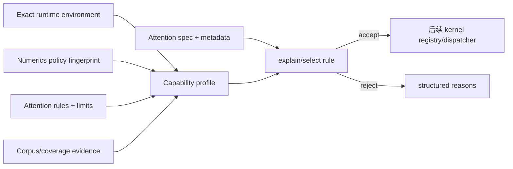

# Attention Backend Capability Profile

> 状态：Capability schema v1  
> 日期：2026-08-19  
> 当前 manifest：空；没有注册或暗示任何可运行昇腾 backend

## 1. 为什么需要 Attention 专用 profile

通用 kernel registry 可以按 op、dtype、layout、SoC 和 feature 过滤 kernel，但 Attention
量化支持不能只写成“支持 int8”或“支持某个 SoC”。同一个 `int8` KV 可能是 tensor、token、
page 或 group scale，也可能使用不同 axis/group size/zero-point；mask、RoPE/ALiBi、GQA、
head dimension、numerics policy 和 metadata 容量同样会改变真实支持范围。

`AttentionBackendCapabilityProfile` 是 kernel descriptor 上层的 deployment evidence envelope：



它不替代 kernel manifest：profile 证明某个 backend family 在固定环境中的能力范围，kernel
descriptor 再从范围内选择具体 AOT/JIT/aclnn 实现。两者都必须通过，不能任一方单独宣称
可运行。

## 1.1 Kernel capability binding

每个非 reference 的 `attention.*` kernel descriptor 必须携带
`KernelCapabilityBinding(domain="attention")`，其中固定 profile id、rule id 和完整 profile
fingerprint。联合 validator 做双向证明：

- descriptor → profile/rule：identity、fingerprint、backend、mode 必须精确匹配；
- descriptor constraints 必须是 rule 的子集，并锁定 profile 的唯一 SoC；
- rule required features 不能在 descriptor 中遗漏；
- 每个 runnable profile 的每条 rule、每个 mode 至少有一个 concrete descriptor；
- draft/protocol profile 不能授权 runnable kernel；
- 非 Attention kernel 不能借用 Attention binding。
- artifact target SoC 必须等于 profile exact SoC，且 Attention launch ABI 必须兼容。

因此 “functional profile 没有 artifact” 和 “Attention artifact 没有 conformance profile” 都会
使 manifest validation 失败。profile fingerprint 包含 evidence，证据更新会主动令旧 kernel
binding 失效并要求重新审核。

通过双向 validator 仍只是 manifest 完整性。运行时还必须调用
`select_attention_dispatch()`，把具体 framework plan、观察到的 environment、重新验证的
evidence 和最终 kernel 固化为 `AttentionDispatchReceipt`。完整流程见
[`attention_dispatch_receipt.md`](attention_dispatch_receipt.md)。
制品内容身份和 entry-point 参数协议见
[`attention_kernel_artifact.md`](attention_kernel_artifact.md)。

## 2. Exact runtime environment

`AttentionRuntimeEnvironment` 固定：

- SoC model 与 revision、AI Core 数量；
- driver、firmware、CANN；
- PyTorch、torch_npu、Ascend compiler；
- Python ABI 和已探测 feature。

`functional`/`optimized` profile 禁止 `unknown`、`unavailable`、`unset` 等占位值，且
`ai_core_count > 0`。runtime 必须将观察到的完整 environment fingerprint 与 profile 精确
比较；v1 不做 `>=` 版本范围匹配，也不做相似 SoC 猜测。

## 3. Capability rule

一条 `AttentionCapabilityRule` 表达一个内部一致的 feature set：

- Attention modes、NHD/HND；
- `(q_dtype, kv_dtype, output_dtype)` 三元组；
- dense KV 开关和完整 `QuantSpec` 白名单；
- position encoding、packed/unpacked/no mask、effective causal；
- QK/VO 最大维度与整除要求、最大 GQA group size；
- sliding window、soft cap、FP16 QK reduction、profiler、multi-token decode；
- `AttentionMetadataLimits`；
- runtime required features。

量化匹配使用完整 `QuantSpec` equality/fingerprint，而不是只看 storage dtype。换 scheme、
granularity、axis、group size、zero-point、packing order 或 physical layout 都会拒绝。

多个 rule 采用显式 OR：至少一条完整接受才可进入后续 dispatch。`explain()` 保留每条 rule
全部 rejection reasons，便于诊断是量化语义、shape、资源还是环境不匹配。

## 4. 状态与证据

| 状态 | 含义 | 可用于生产 dispatch |
| --- | --- | --- |
| `draft` | schema/design 声明，未完成 protocol 测试 | 否 |
| `protocol` | metadata/adapter 协议测试 | 否 |
| `functional` | 固定环境完成数值 conformance | 是，仍非性能声明 |
| `optimized` | functional 加性能门禁 | 是 |

`functional`/`optimized` 必须携带不低于自身等级的
`AttentionCapabilityEvidence`。Evidence 绑定：

- corpus fingerprint 和 coverage policy name；
- 实际通过的 case ids；
- covered/total cell 计数；
- runner 名称和不可变 result digest。

`validate_evidence()` 重新确认 case 存在、coverage 计数一致，并要求 evidence subset 覆盖
profile 中每条 rule。result digest 当前是外部测试记录的 identity；未来签名/制品 provenance
应在发布安全设计中扩展，不能把普通 SHA-256 当作真实性证明。

packaged manifest loader 对所有 `functional/optimized` profile 自动使用内置 corpus v4 与
coverage policy v4 重跑上述 evidence/rule 交叉验证；仅仅填写一个格式正确的 evidence 对象
不能完成注册。`draft/protocol` 可以保留未完成 evidence，但永远不能用于 runnable dispatch。

## 5. 当前诚实状态

packaged [`attention_capabilities.json`](../flashinfer_npu/data/attention_capabilities.json)
有效但 `profiles=[]`。CLI：

```bash
python3 -m flashinfer_npu attention-capabilities
```

当前输出 `No Attention backend capability profiles are registered.`。Host oracle、protocol
fake、corpus 通过或 schema test 均不会自动生成 functional profile；只有在用户选定并验证
真实 SoC/CANN/torch_npu tuple 后，才允许把经过审核的 profile 加入 manifest。

## 6. 注册真实 profile 的门禁

1. 固定 runtime tuple，并保存 feature probe 原始记录。
2. 为每条 rule 选择能实际触发它的 corpus cases；不能只通过无关的全局 corpus。
3. 同时比较 output/LSE，并记录量化误差与 kernel 误差。
4. 验证 numerics policy、stream/allocator lifetime、alias 和 workspace 少 1 byte 等失败路径。
5. functional evidence 通过后再注册 kernel descriptor；两份 manifest 交叉验证 op/rule/artifact。
6. optimized 状态还需绑定 benchmark methodology、阈值和回归结果。
