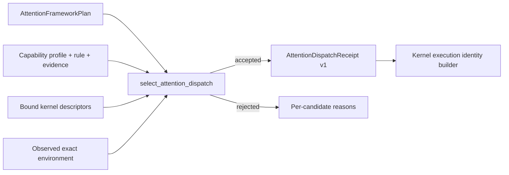

# Attention Dispatch Receipt 契约

> 状态：Framework dispatch receipt v1  
> 日期：2026-08-20  
> 范围：把 framework plan、capability evidence 与 kernel descriptor 串成可复核选择结果；不加载或执行设备 artifact

## 1. 要解决的断点

Attention 的通用 kernel registry 和专用 capability profile 不能独立完成设备 dispatch：

- registry 只知道 op、dtype、layout、SoC feature、priority 和 workspace formula；
- capability profile 才知道完整 QuantSpec、mask/position、GQA、metadata limits、精确 runtime tuple、numerics policy 和 corpus evidence；
- framework plan 保存数学语义与 resource admission，但过去没有记录它为何能进入某个 kernel。

`AttentionDispatchReceipt` 是这三套事实源的不可变连接结果。



Receipt 不是签名、安全 token 或运行成功证据。它是版本化、可序列化、可重新计算 fingerprint 的 plan-time 决策记录；消费它之前仍要用当前 plan/profile/descriptor/environment 重新验证。

设备执行后的数值结果不能回写或扩写 receipt。通过 correctness budget 的 candidate 由
[`AttentionAccuracyDispatchBinding`](attention_accuracy.md) 作为独立 post-dispatch 记录
绑定到 receipt；该 binding 重新验证整条 authority chain，但不会反过来授权 kernel dispatch。

## 2. 选择顺序

`select_attention_dispatch()` 固定执行以下门禁：

1. 对全部输入 profile/descriptor 运行双向 manifest binding validator；缺 artifact、孤立 runnable rule、错误 profile fingerprint 或越界 descriptor 直接视为 manifest 错误。
2. 用观察到的 `AttentionRuntimeEnvironment` 与 profile 的精确 fingerprint 比较，不做相似 SoC 或版本范围猜测。
3. 对完整 Attention spec/metadata 执行 rule matching，包括 QuantSpec、mask、position、head/GQA 和 admission limits。
4. 重新验证 evidence 的 corpus fingerprint、case ids、coverage cells 与 rule coverage。
5. 再应用 descriptor constraints 和显式 backend policy。
6. tuning 记录只能从已经接受的候选中选择；否则按 `priority`、`kernel_id` 稳定排序。

`explain_attention_dispatch()` 返回每个 bound candidate 的全部拒绝原因。没有候选时不会退回 reference，也不会构造 provisional receipt。

## 3. Receipt 字段

Receipt 固定：

- mode、plan、admission 和 workload fingerprint；
- numerics policy fingerprint；
- profile id/fingerprint、rule id、exact environment fingerprint；
- evidence id 与 result digest；
- kernel id/fingerprint、backend；
- artifact fingerprint、logical launch ABI fingerprint 与 binary ABI fingerprint；
- float/int workspace 的独立 required bytes 与 alignment；
- `priority` 或 `tuning` selection source，以及调用者请求的 backend policy。

Kernel fingerprint 覆盖结构化 artifact provenance、logical/binary launch ABI、constraints、
op/tiling schema、capability binding 和两条 workspace formula。Receipt 还单独固定 artifact
及两种 ABI fingerprint，便于精确诊断。Profile fingerprint 覆盖 exact environment、rules、
numerics policy 和 evidence。因此任一权威对象发生变化，旧 receipt 重验证都会失败。

## 4. Float/int workspace 不可合并

FlashInfer batch Attention wrapper 暴露两块 caller-owned workspace。为避免“总字节数相同但分配给错误 buffer”的问题，`KernelDescriptor` 现在有两条公式：

```text
workspace      -> float workspace formula
int_workspace  -> int workspace formula
```

旧 descriptor 未声明 `int_workspace` 时得到显式零公式。Receipt 分别记录两者的 required bytes/alignment；`build_kernel_execution_identity()` 要求 `AttentionWorkspaceContract.required_sizes` 与二元组精确相等，同时要求实际 rank-1 contiguous `uint8` TensorView 的 device 和 numel 与两个 capacity 精确一致。只比较总和不被接受。

## 5. 与 execution identity 的关系

`build_kernel_execution_identity()` 会先重验证 receipt，再生成带以下原子 binding 的非 reference identity：

- capability profile id/fingerprint；
- rule id；
- evidence id；
- kernel id/fingerprint。

构造成功只证明 framework 层的 plan、资源和选择权威一致。它不导入 artifact、不调用
aclrt/aclnn、不创建 stream event，也不产生 `device_graph` capture。Host 侧现已定义
`AttentionLaunchLeaseContract`，可把 receipt/execution identity 指纹绑定到具体地址、allocator
generation、stream 和 completion event 状态机；真实 adapter 仍必须从运行时取得并证明这些值。

## 6. 当前证据与诚实状态

Host mutation tests 已覆盖：

- receipt round-trip 和稳定 fingerprint；
- environment/backend/evidence rejection；
- tuning 不能越过 accepted candidate set；
- plan/profile/evidence/kernel/workspace 任一变化的重验证失败；
- artifact provenance 与 logical/binary launch ABI mutation；
- float/int workspace formula、capacity、TensorView 和 alignment 绑定；
- receipt 到非 reference execution identity 的完整构造。

所有 functional profile 和 kernel 均为测试内 synthetic fixture。Packaged manifests 继续是 `profiles=[]` 和 `kernels=[]`，因此当前仍没有任何可 dispatch 的 Ascend Attention backend。

Artifact/ABI 细节见
[`attention_kernel_artifact.md`](attention_kernel_artifact.md) 和
[`attention_launcher_abi.md`](attention_launcher_abi.md)。
