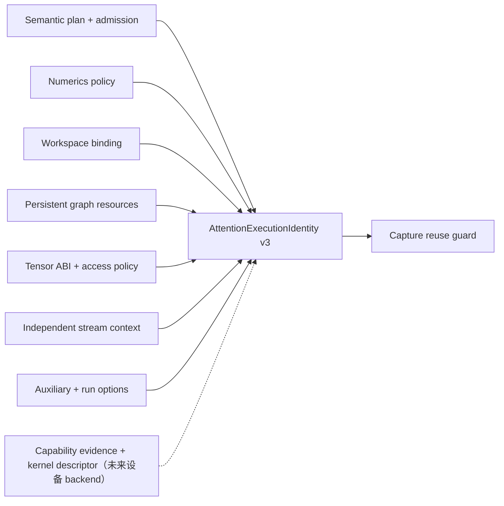
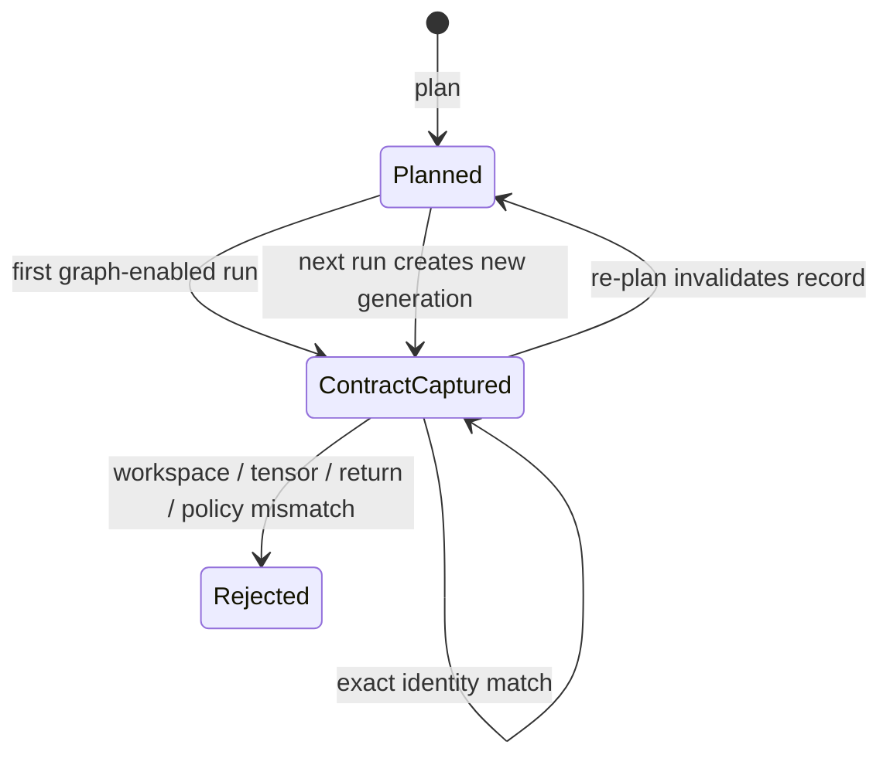

# Attention 执行与图捕获身份契约

> 状态：Host structural capture contract v3  
> 日期：2026-08-20  
> 范围：框架侧执行复用 guard；不表示已经创建 CUDA Graph、Ascend Graph 或 NPU executable

## 1. 为什么需要联合 identity

只比较 Attention workload 或 plan fingerprint 不足以安全复用一次执行捕获。相同数学算子仍可能绑定到不同的 metadata 容量、workspace generation、tensor stride、辅助张量、运行标量、数值策略或 backend kernel。v3 因此把一次可复用执行拆成十个必须同时匹配的维度：

| 维度 | v3 field | 防止的错误复用 |
| --- | --- | --- |
| 数学与 metadata | `plan_fingerprint` | shape、mask、layout、QuantSpec 或具体 metadata 改变 |
| 资源准入 | `admission_fingerprint` | 用宽 profile 生成的 plan 复用较窄资源 |
| 数值策略 | `numerics_policy_fingerprint` | NaN/Inf/空支持行语义漂移 |
| Scratch 绑定 | `workspace_fingerprint` | reset 后复用旧容量或 generation |
| 持久图资源 | `graph_resources_fingerprint` | indptr/page/mask 缓冲区集合或容量改变 |
| Tensor ABI | `tensor_signature_fingerprint` | shape/stride/dtype/device/writable/stream 改变 |
| 独立 stream claim | `stream_context_fingerprint` | packet/lease 同时换绑到另一个 stream 后绕过综合 tensor hash |
| Auxiliary ABI | `auxiliary_fingerprint` | mask/per-head scale/profiler/ALiBi role 或 TensorView 改变 |
| Run scalar | `run_options_fingerprint` | scalar Q/K/V scale、soft cap 或 flags 改变 |
| 访问策略 | `access_policy_fingerprint` | alignment、contiguous 或 alias policy 改变 |

`return_lse`、固定 batch size 和 `q_len_per_req` 也直接进入 identity，避免返回形态和图静态边界被哈希层次掩盖。

非 reference backend 必须同时绑定完整的 capability profile、rule、evidence 和 kernel descriptor fingerprint。六个 kernel binding 字段要么全部存在，要么全部不存在；`reference` identity 禁止伪造 kernel binding，非 reference identity 则禁止缺失它。`AttentionDispatchReceipt` 与 `build_kernel_execution_identity()` 已实现这条 framework 构造路径，但不会加载或执行设备 artifact。

## 2. Graph resource contract

`AttentionGraphResourceContract` 单独描述 wrapper 生命周期内固定的 metadata buffer：

- Attention mode 与固定 batch size；
- 每个 buffer 的稳定逻辑名称、dtype、capacity 和 device；
- 所有持久 buffer 必须位于同一 device，并与 workspace device 一致；
- paged prefill 为 4 个必需 buffer，加 2 个可选 mask buffer；
- ragged prefill 为 2 个必需 buffer，加 2 个可选 mask buffer；
- paged decode 固定为 3 个 buffer。

这里记录的是资源规格，不是 buffer 内容。当前 Host plan 仍保存具体 metadata 值；re-plan 会使旧 capture record 失效。

## 3. Tensor signature 的边界

Host structural signature 包含：

- Q、KV component、out、LSE、float/int workspace 的 shape、stride、dtype、device 和 writable；
- custom mask、逐 head scale、profiler、ALiBi slope 的 role 与 TensorView；
- scalar Q/K/V scale、run-time soft cap 与 flags；
- 完整 KV cache spec、packed/quantized 表示；
- stream device、stream id 和 ordered 标志。

它刻意排除 process-local storage id、地址、storage capacity、offset 和实时 alignment。这样两个新分配但结构等价的 `ReferenceTensor` 可以复用 Host 合同，也避免把 Python object id 当作可持久化设备证据。

这项排除只适用于 `host_contract`。框架层现已使用独立的
`AttentionStorageLease`/`AttentionLaunchLeaseContract` 描述地址稳定、allocator generation、
storage bounds、alignment、stream ownership 和完成事件；这些字段不污染结构 identity，但可
在提交前与 identity/receipt fingerprint 绑定。v3 另外保存独立的 stream-context fingerprint，
使 launch packet 可以从 `device + stream_id + ordered` 重算并交叉校验，不必反解综合 tensor
signature。仅凭 v3 structural signature 或只构造 Host
lease 不得启动设备图复用。

## 4. 生命周期

当前 graph-enabled Host wrapper 的第一次成功运行发布 `AttentionCapturedExecution(capture_kind="host_contract")`。后续运行逐字段比较候选 identity；任一变化抛出 `AttentionCaptureCompatibilityError`，不会静默重捕获或降级。`plan()` 是明确的失效边界，下一次运行生成新的 capture generation。

非 graph wrapper 永远不发布 capture record。`capture_kind="device_graph"` 只允许绑定非 reference kernel identity；当前仓库没有任何代码能够产生这种记录。

## 5. 当前证据与后续门禁

Host 测试已覆盖：

- identity/capture JSON-like dict round-trip 与稳定 fingerprint；
- 每个 fingerprint 维度的 mutation rejection；
- 等价新分配 Host tensor 的结构复用；
- `return_lse` 改变、workspace reset 和 re-plan 生命周期；
- graph buffer 名称、容量和唯一性；
- reference/kernel binding 互斥。
- dispatch receipt 到非 reference identity 的重验证构造；
- float/int workspace formula、capacity、TensorView 与 alignment 的独立匹配。
- address binding round-trip、allocation generation stale rejection、可写区间冲突、graph lifetime
  与 completion-event ownership。
- auxiliary/run-options fingerprint mutation、scalar capture stale rejection 与 runtime role exact lease binding。
- stream context 独立 fingerprint；同步修改 launch lease、stream binding 和 opaque handle 仍会因
  execution identity 不匹配而拒绝。

接入首个 Ascend backend 前仍必须补齐：

1. 用 torch_npu/aclrt adapter 从真实 allocator、stream 和 event 取得并核验 lease 证据；
2. 真实 artifact 加载器、backend workspace query 和 graph auxiliary buffer；
3. 真实图 API 对动态 metadata 更新、异步错误传播和销毁顺序的验证。

Dispatch receipt 的选择和审计规则见
[`attention_dispatch_receipt.md`](attention_dispatch_receipt.md)。
二进制 ABI 与租约状态机见
[`attention_launcher_abi.md`](attention_launcher_abi.md)。
辅助张量和 POD 物化规则见
[`attention_launch_binding.md`](attention_launch_binding.md)。
Identity、dispatch、Host/device lease 和最终参数的完整汇总见
[`attention_launch_packet.md`](attention_launch_packet.md)。

在这些证据存在前，本契约只证明框架能拒绝已知不兼容复用，不证明任何 NPU 图执行能力。
