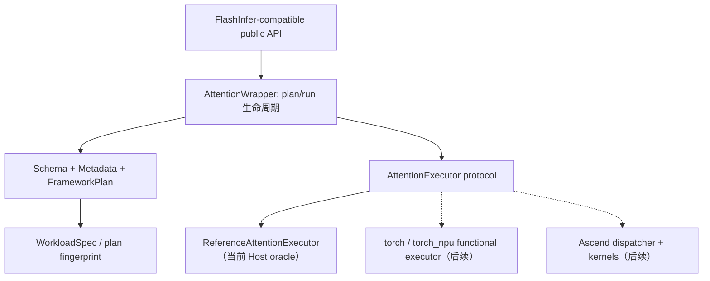
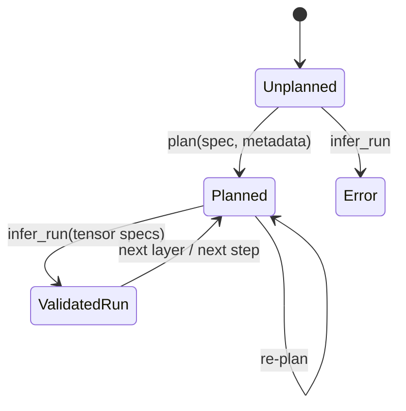

# FlashInfer-NPU Attention 框架对标设计

> 状态：Attention framework design v1.11
> 日期：2026-08-21  
> 当前阶段：纯 Host 验证，不依赖 NPU、CANN、PyTorch 或 torch_npu

## 1. 当前范围

本阶段只对标 FlashInfer 的核心 MHA/GQA Attention 框架面：

- `BatchAttention` 统一 mixed prefill/decode。
- `single_prefill_with_kv_cache`。
- `single_decode_with_kv_cache`。
- `BatchPrefillWithPagedKVCacheWrapper`。
- `BatchPrefillWithRaggedKVCacheWrapper`。
- `BatchDecodeWithPagedKVCacheWrapper`。
- 上述 wrapper 的 workspace、`plan/run`、图模式固定 shape、KV layout、mask、LSE 和输出 shape 语义。

本阶段不处理：

- Ascend C、CANN 或 NPU kernel 实现。
- CUDA/TRT-LLM/CuDNN/CuTe 等厂商后端适配。
- MLA、sparse、cascade、POD、page mutation 等独立 Attention 扩展模块。
- GEMM、MoE、sampling、norm 等非 Attention 能力域。

这些内容不是永久移除，而是不进入当前框架验证门禁。

上游依据：

- [FlashInfer BatchAttention 源码](https://github.com/flashinfer-ai/flashinfer/blob/main/flashinfer/attention/_core.py)
- [FlashInfer Prefill 源码](https://github.com/flashinfer-ai/flashinfer/blob/main/flashinfer/prefill.py)
- [FlashInfer Decode 源码](https://github.com/flashinfer-ai/flashinfer/blob/main/flashinfer/decode.py)
- [FlashInfer Attention API 文档](https://docs.flashinfer.ai/api/attention.html)

## 2. 框架层目标

在写任何设备代码前，框架层必须能够独立证明：

1. 同一组输入 metadata 会生成稳定、可哈希的 workload 与 plan fingerprint。
2. Paged/ragged CSR metadata 的 shape、单调性、页容量和最后一页长度得到严格验证。
3. `NHD`、`HND` 与 packed/separate KV cache 的物理 shape 没有隐含约定。
4. GQA 的 `num_qo_heads % num_kv_heads == 0` 在 plan 阶段失败，而不是 kernel 中失败。
5. `plan()` 之前不能 `run()`；re-plan 明确产生新 generation，但相同语义保持相同 fingerprint。
6. 图模式冻结 batch size 和 `q_len_per_req`。
7. 输出、out buffer 与 LSE shape/dtype 能在不执行 kernel 时推导和校验。
8. plan-time feature 与 run-time 参数一致，例如 soft cap 和 profiler buffer。
9. Framework-only、reference、functional、optimized 四种状态在 parity 中不混淆。

### 2.1 当前分层



当前 `ReferenceTensor`、`ReferenceKVData` 和 `ReferenceAttentionExecutor` 是参考语义基础设施，
用于冻结 Attention 数学语义；它们不是最终 tensor frontend，也不会进入生产自动 dispatch。
`AttentionExecutor` 是边界：同一个 plan/run 契约可以注入 Host reference、未来的
PyTorch functional 实现或昇腾设备实现，而上层 metadata 不随 backend 改写。

公共 API facade 的签名与参数归属设计见
[`attention_frontend_contract.md`](attention_frontend_contract.md)。
量化 KV 的 shape、scale、zero-point 与 INT4 packing 契约见
[`attention_quantization.md`](attention_quantization.md)。
小型 correctness case 的版本化 JSON 和 replay 契约见
[`attention_trace.md`](attention_trace.md)。
JIT/provider 状态、stream 与资源 owner 的独立协议 trace 见
[`attention_protocol_trace.md`](attention_protocol_trace.md)。
Caller-owned workspace 的容量与生命周期见
[`attention_workspace.md`](attention_workspace.md)。
Plan、准入、workspace、tensor ABI 与未来 kernel binding 的联合复用 guard 见
[`attention_execution_identity.md`](attention_execution_identity.md)。
Stride/storage/alias/device/stream 的 adapter 目标契约见
[`attention_tensor_contract.md`](attention_tensor_contract.md)。
可选 Torch metadata adapter 的映射规则和真实运行时门禁见
[`attention_torch_adapter.md`](attention_torch_adapter.md)。
NaN/Inf/零支持 softmax 与 metadata admission limits 分别见
[`attention_numerics.md`](attention_numerics.md) 和
[`attention_resource_limits.md`](attention_resource_limits.md)。
未来 backend 的精确环境、完整 QuantSpec rule 与 conformance evidence 见
[`attention_capability_profile.md`](attention_capability_profile.md)。
Plan/profile/evidence/kernel 的可复核选择结果见
[`attention_dispatch_receipt.md`](attention_dispatch_receipt.md)。
Kernel artifact provenance 与 launch ABI 见
[`attention_kernel_artifact.md`](attention_kernel_artifact.md)；冻结的 C POD/error ABI 与地址租约见
[`attention_launcher_abi.md`](attention_launcher_abi.md)。
六种 mode 的 canonical plan payload 见
[`attention_plan_metadata_wire.md`](attention_plan_metadata_wire.md)。
Auxiliary role、run-options 与 TensorView/KV/aux POD 物化见
[`attention_launch_binding.md`](attention_launch_binding.md)。
完整 Host/device lease ownership 与 13 参数提交记录见
[`attention_launch_packet.md`](attention_launch_packet.md)。
Artifact verification、resolved symbol、provider error/event 与 unload 生命周期见
[`attention_launcher_provider.md`](attention_launcher_provider.md)。
外部 trace/corpus 的 pre-construction JSON 资源门禁见
[`attention_json_envelope.md`](attention_json_envelope.md)。

## 3. 上游 API 映射

| FlashInfer API | 当前框架模型 | 状态 |
| --- | --- | --- |
| `attention.BatchAttention` | `AttentionMode.BATCH_MIXED_PAGED` | Public facade + Host reference |
| `single_prefill_with_kv_cache` | `SINGLE_PREFILL` + `SingleAttentionMetadata` | Public facade + Host reference |
| `single_decode_with_kv_cache` | `SINGLE_DECODE` + `SingleAttentionMetadata` | Public facade + Host reference |
| `BatchPrefillWithPagedKVCacheWrapper` | `BATCH_PREFILL_PAGED` + `PagedPrefillMetadata` | Public facade + Host reference + mode-bound provider runtime |
| `BatchPrefillWithRaggedKVCacheWrapper` | `BATCH_PREFILL_RAGGED` + `RaggedKVMetadata` | Public facade + Host reference |
| `BatchDecodeWithPagedKVCacheWrapper` | `BATCH_DECODE_PAGED` + `PagedKVMetadata` | Public facade + Host reference + mode-bound provider runtime |
| `workspace_size()` | Backend-explicit workspace query | paged prefill/decode Host facade 返回真实 `(0,0)`；Ascend requirement 仍为 unknown |
| `run()` | active plan + private executor | single 与三类 batch wrapper 均有同名 Host facade；paged prefill/decode 可进入私有 provider runtime |

`AttentionFrameworkSession` 是内部 plan 生命周期状态机。两个 single API、三个 batch
wrapper 与 mixed `BatchAttention` 均由同名 public Host facade 暴露。

每个非 reference batch wrapper 必须拥有一个按 `AttentionMode` 绑定的
`AttentionOperatorRuntime`。mode 在 wrapper 构造时冻结；与该 mode 不匹配的 plan 必须在
任何 package probe、callable import 或 provider prepare 之前失败。holistic
`BatchAttention` 使用固定为 `BATCH_MIXED_PAGED` 的兼容 runtime，其他 wrapper 复用同一
自动选择、原子发布和 run lowering 生命周期。

共享 batch lifecycle 默认不创建 provider runtime。只有已经具备完整 public
`plan()`/`run()` lowering 的 wrapper 才能显式开启该路径；未接通的 ragged prefill
在 registry resolution 和 package loading 之前失败，不能形成只有 plan 或只有 run
一侧可用的半连接状态。

## 4. Metadata 契约

### 4.1 Paged decode

```text
indptr:        [batch + 1]，CSR page offsets
indices:       [indptr[-1]]，物理 page id
last_page_len: [batch]
page_size:     positive integer
```

每个非空请求必须满足：

```text
1 <= last_page_len <= page_size
kv_len = (num_pages - 1) * page_size + last_page_len
```

空请求使用 `num_pages == 0` 且 `last_page_len == 0`。共享 page index 允许出现，因此不强制 `indices` 唯一。

### 4.2 Paged prefill

在 paged decode metadata 之外增加：

```text
qo_indptr: [batch + 1]
```

Query 总行数为 `qo_indptr[-1]`，每请求 query 长度由相邻差值得到。

### 4.3 Ragged prefill

```text
qo_indptr: [batch + 1]
kv_indptr: [batch + 1]
```

K/V tensor 总 token 数必须等于 `kv_indptr[-1]`。

### 4.4 Mixed BatchAttention

```text
qo_indptr:  [batch + 1]
kv_indptr:  [batch + 1]，page offsets
kv_indices: [kv_indptr[-1]]
kv_len_arr: [batch]，token lengths
```

每个 `kv_len` 必须能够装入对应 page 数量，并且不能少于“前面所有满页 + 最后一页一个 token”。
`qo_indptr` 允许零长度 segment：请求可以没有 query 但保留 KV，也可以同时没有 Q/KV；这种
请求不产生 output/LSE 行。不同请求可共享物理 page，同一请求也可重复引用 page，逻辑 token
顺序严格由 `kv_indices` 的 page-table 顺序决定。mixed 语义合同包含 decode-like
`q_len=1`、prefill `q_len>1`、全空 batch、GQA、NHD/HND、因果 bottom-right 对齐、共享/重复页和
精确 INT8 去量化；逐请求 single oracle 或 dense 路径定义其数值预期。

## 5. KV Cache layout

### NHD

```text
separate K: [num_pages, page_size, num_kv_heads, head_dim_qk]
separate V: [num_pages, page_size, num_kv_heads, head_dim_vo]
packed KV:  [num_pages, 2, page_size, num_kv_heads, head_dim]
```

### HND

```text
separate K: [num_pages, num_kv_heads, page_size, head_dim_qk]
separate V: [num_pages, num_kv_heads, page_size, head_dim_vo]
packed KV:  [num_pages, 2, num_kv_heads, page_size, head_dim]
```

Packed KV 只有在 `head_dim_qk == head_dim_vo` 时成立；不同维度必须使用 separate K/V，防止相同字节数被错误解释。

## 6. AttentionPlanSpec

Plan key 当前包含：

- Attention mode。
- QO/KV head count、QK/VO head dimension。
- Q/KV/O dtype。
- KV layout 和可选 KV `QuantSpec`。
- causal、position encoding、sliding window。
- softmax scale 与 logits soft cap。
- RoPE scale/theta。
- FP16 QK reduction 选择。
- batch decode 的 `q_len_per_req`。
- custom mask 类型。
- metadata fingerprint。

默认 softmax scale 是 `1 / sqrt(head_dim_qk)`。所有影响 dispatch 或 code generation 的字段都进入 `WorkloadSpec`，不能作为 run-time 隐式状态遗漏。

## 7. Custom mask

Custom mask 只属于 prefill 路径：

- Unpacked mask 使用 bool，元素数为 `sum(q_len[i] * kv_len[i])`。
- Packed mask 使用 uint8，并按每个 request segment 独立 pack；大小为 `sum(ceil(segment_bits[i] / 8))`，不能简单使用 `ceil(total_bits / 8)`。
- 存在 custom mask 时，causal 参数被覆盖，生成的 effective workload 标记为 non-causal + custom mask。
- Decode 与当前 mixed `BatchAttention` 不接受 custom mask。

## 8. Plan/run 状态机



`infer_run()` 不执行数学计算，只验证：

- Q shape/dtype/device。
- KV storage、layout、head count、head dimensions 和 page capacity。
- out/LSE shape、dtype 和 device。
- soft cap plan/run feature 一致性。
- profiler buffer 是否满足 plan-time 要求。

内部 `AttentionWrapper.run()` 在上述校验后把 plan 注入 executor。当前 reference executor
使用纯 Python 标量计算，只服务于微型 conformance case，不改变 `infer_run()` 的职责。

## 9. Host 数值参考语义

零依赖 reference 定义以下语义：

- single prefill、single decode；
- paged/ragged batch prefill、paged batch decode、mixed `BatchAttention`；
- MHA/GQA 的 query-head 到 KV-head 映射；
- bottom-right aligned causal mask、sliding window、unpacked custom mask；
- little-endian、按 request segment 独立打包的 packed custom mask；
- `NHD`/`HND`、packed/separate KV storage 和逻辑页到物理页映射；
- LLaMA half-split RoPE、ALiBi、softmax scale、scalar/per-head Q/K/V scale、logits soft cap、输出和 float32 LSE；
- multi-token batch decode 的 flattened query 与 causal 语义。
- `QuantSpec` 驱动的 INT8/UINT8、对称/非对称、per-tensor/per-token/group scale、
  zero-point、packed INT4 数据寻址，以及 single/ragged/paged/mixed 端到端消费。

Reference 目前明确不实现：

- profiler buffer 写入；
- FP8、NVFP4、MX、非逻辑 physical layout 和 NPU accumulation rounding。

这些路径会显式失败，不允许静默退化。scalar/per-head `q_scale/k_scale/v_scale` 是
Attention runtime scaling；量化 storage 的 scale/zero-point 则由显式量化 tensor 绑定，
两层语义不会混用。

## 10. Decode 多 token 语义

当前 FlashInfer batch decode 已支持 `q_len_per_req > 1`。框架契约因此采用：

```text
q.shape[0] = batch_size * q_len_per_req
```

多 token decode 自动使用 causal 语义。图模式下 batch size 和 `q_len_per_req` 都被冻结；任一变化都必须使用另一个 wrapper/session。

## 11. Attention conformance 矩阵

| 维度 | 当前 Host 门禁 | 后续 functional 门禁 | 后续 NPU 门禁 |
| --- | --- | --- | --- |
| API/lifecycle | schema、plan/run、graph fixed shape、structural capture identity | exact public signatures | 同 functional + address/lifetime guard |
| Metadata | paged/ragged/mixed CSR 与容量 | torch tensor adapter | device metadata 与 stream lifetime |
| 数学语义 | Python scalar oracle | 与 oracle/高精度实现逐项比较 | 与 oracle + functional 比较 |
| Layout | NHD/HND、packed/separate、versioned physical descriptor/conversion plan、KV POD/binary ABI v2 Host gate | contiguous/stride/device/descriptor checks | v2 packet/provider + converter/kernel capability matrix |
| Mask/position | causal/window/custom/ALiBi | 补 RoPE、packed mask | kernel feature predicates |
| 量化 | `QuantSpec` + INT8/UINT8/INT4 indexed dequant oracle + 双层 accuracy budget | Torch quantized tensor adapter + candidate report | 量化 kernel correctness + 独立 backend budget |
| 性能 | 不设性能目标 | 不设性能目标 | latency、bandwidth、workspace、回归门禁 |

框架阶段的 exit gate 是：所有 P0 Attention 语义均有 schema 定义和数值 oracle case，
未知语义必须列为显式 gap。它不要求 NPU 环境，也不以性能数据作为通过条件。

## 12. Parity 状态定义

| 状态 | 含义 |
| --- | --- |
| `missing` | 尚无对应框架或实现 |
| `framework` | 仅提供 schema/lifecycle/shape 合同，不执行 tensor math |
| `reference` | 有可执行的高精度或组合 reference |
| `functional` | 有可执行设备实现并通过 conformance |
| `optimized` | 通过 correctness 与性能门禁 |

`parity-report --require-complete` 只接受 `functional` 或 `optimized`，因此框架合同不会被误报为库已经可运行。

## 13. 当前实现边界

`reference` 状态可用于描述同名 single API、batch wrapper 的 constructor/plan/run、workspace
reset、graph property、Host structural capture identity 与 lifecycle alias。`capture_kind="host_contract"`
只表示结构合同，不表示已建立设备 graph。

可选 Torch adapter 只把 tensor metadata 转成 framework contract，没有 functional executor；
因此不表示 Torch frontend 或 NPU backend 已经可运行。packaged kernel manifest 和默认 runtime
registry 均不启用 Attention NPU implementation。具体状态以
[`support_matrix.md`](support_matrix.md) 和运行时 registry 为准。

## 14. 扩展顺序

1. conformance workflow 联合生成 numerical + protocol corpus，并自动绑定 case id/input fingerprint；
2. accuracy corpus 定义 scale 极值、累加 dtype、shape/head mapping 预算矩阵和可信 runner attestation；
3. Torch frontend/functional executor 通过同一 framework plan 和 corpus 接入；
4. 为一个固定 SoC/CANN/package tuple 建立 capability profile、operation catalog 和 provider adapter；
5. 只有完整 authority、artifact/callable、layout、numerical 与 execution evidence 的组合才能升级为 `functional`。
