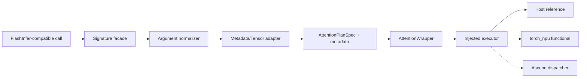

# FlashInfer-NPU Attention Frontend Contract

> 文档状态：Single + Batch wrapper contract v0.7
> 上游基线：`flashinfer-ai/flashinfer@919a24e5b1d971d50c97a3cd38862f801527eab5`，2026-08-27 接口快照
> 实现边界：框架接口与 Host reference；不依赖 PyTorch、torch_npu、CANN 或 NPU

## 1. 目标

Public frontend 必须让已有 FlashInfer 调用方以最少改动迁移，同时不能把 CUDA
backend 名称或内存语义伪装成昇腾能力。公共签名、默认值、shape 和返回类型尽量精确；
vendor-specific 开关进入显式 capability translation，并在无法等价时立即报错。

上游签名依据：

- [single/batch prefill 源码](https://github.com/flashinfer-ai/flashinfer/blob/919a24e5b1d971d50c97a3cd38862f801527eab5/flashinfer/prefill.py)
- [single/batch decode 源码](https://github.com/flashinfer-ai/flashinfer/blob/919a24e5b1d971d50c97a3cd38862f801527eab5/flashinfer/decode.py)
- [BatchAttention 源码](https://github.com/flashinfer-ai/flashinfer/blob/919a24e5b1d971d50c97a3cd38862f801527eab5/flashinfer/attention/_core.py)

## 2. Frontend 分层



职责边界：

1. **Signature facade**：保留参数名、顺序、默认值、overload 返回语义和 deprecated alias。
2. **Argument normalizer**：处理 `None` 默认值、dtype canonicalization、packed mask 优先级和 backend policy。
3. **Metadata/Tensor adapter**：只抽取 shape、dtype、device、layout 和整数 metadata；不执行数学计算。
4. **Plan**：冻结所有影响 dispatch/codegen 的字段；run-time 参数不得偷偷改变 plan feature。
5. **Executor**：reference、functional、NPU 共享同一个规范化调用，不让 frontend 感知设备实现细节。

## 3. P0 公共符号

| 上游符号 | 本地模块 | 当前内部模型 | Frontend 交付条件 |
| --- | --- | --- | --- |
| `single_prefill_with_kv_cache` | `flashinfer_npu.prefill` | `SINGLE_PREFILL` | Public facade + Host oracle + ephemeral mode-bound provider runtime |
| `single_decode_with_kv_cache` | `flashinfer_npu.decode` | `SINGLE_DECODE` | Public facade + Host oracle + ephemeral mode-bound provider runtime |
| `BatchPrefillWithPagedKVCacheWrapper` | `flashinfer_npu.prefill` | `BATCH_PREFILL_PAGED` | Public facade + Host oracle + mode-bound provider runtime；Ascend workspace formula 由 provider 声明 |
| `BatchPrefillWithRaggedKVCacheWrapper` | `flashinfer_npu.prefill` | `BATCH_PREFILL_RAGGED` | Public facade + Host oracle + mode-bound provider runtime；backend-specific scoring 能力由 provider 声明 |
| `BatchDecodeWithPagedKVCacheWrapper` | `flashinfer_npu.decode` | `BATCH_DECODE_PAGED` | Public facade + Host oracle + mode-bound provider runtime；接口覆盖 multi-token decode |
| `attention.BatchAttention` | `flashinfer_npu.attention` | `BATCH_MIXED_PAGED` | Public facade + Host oracle；返回约定固定为 output + LSE |

Deprecated `begin_forward/forward/end_forward` 在 P3 提供兼容 alias，不驱动内部设计。

## 4. 当前上游函数签名快照

### 4.1 Single prefill

参数顺序冻结为：

```text
q, k, v,
scale_q=None, scale_k=None, scale_v=None,
o_dtype=None,
custom_mask=None, packed_custom_mask=None,
causal=False, kv_layout="NHD", pos_encoding_mode="NONE",
use_fp16_qk_reduction=False,
sm_scale=None, window_left=-1, logits_soft_cap=None,
rope_scale=None, rope_theta=None,
backend="auto", return_lse=False,
kv_cache_sf=None, k_scale=None, v_scale=None
```

`return_lse=False` 返回 output；为 `True` 返回 `(output, lse)`。`packed_custom_mask`
优先于 `custom_mask`，Attention 使用 little-endian bit order。

### 4.2 Single decode

```text
q, k, v,
kv_layout="NHD", pos_encoding_mode="NONE",
use_tensor_cores=False,
q_scale=None, k_scale=None, v_scale=None,
window_left=-1, logits_soft_cap=None, sm_scale=None,
rope_scale=None, rope_theta=None,
return_lse=False
```

### 4.3 Batch wrapper 生命周期

三类 batch wrapper 的 public `run(..., return_lse=False)` 返回 output；设为 `True`
返回 `(output, lse)`。provider adapter 根据该内部意图设置外部 package 的 LSE control
与 return schema，不能总是计算后再静默丢弃。caller-owned `out/lse` 只有在选中 operation
明确声明对应 mutable argument 后才能使用；当前返回 tensor 的 package API 不具备该绑定，
所以这两个参数在 package invocation 前显式失败。
ragged prefill 继续公开 `q_scale/k_scale/v_scale/o_scale`。其中 `o_scale` 是输出 scale，
只有选中 operation 的量化 binding 同时声明精确参数名和允许的 plan 输出 dtype 时才会传入；
它不会改变 plan 选择，也不会被解释成 KV scale。

Paged prefill `plan()` 的 P0 参数顺序为：

```text
qo_indptr, paged_kv_indptr, paged_kv_indices,
paged_kv_last_page_len,
num_qo_heads, num_kv_heads, head_dim_qk, page_size,
head_dim_vo=None,
custom_mask=None, packed_custom_mask=None,
causal=False, pos_encoding_mode="NONE",
use_fp16_qk_reduction=False,
sm_scale=None, window_left=-1, logits_soft_cap=None,
rope_scale=None, rope_theta=None,
q_data_type="float16", kv_data_type=None, o_data_type=None
```

Ragged prefill 将四个 paged metadata 参数替换为 `qo_indptr, kv_indptr`，其余核心
Attention 字段保持相同。Batch decode 使用 `indptr, indices, last_page_len,
num_qo_heads, num_kv_heads, head_dim, page_size`，并在 plan 中固定
`q_len_per_req`、window、position encoding 和 dtype。

当前上游还包含 multi-item scoring、attention sinks、backend-specific split-k、PDL、
NVFP4 scale-factor tensor、skip-softmax sparsity、FP16 softmax 与 SP-compression 等参数。
本地 public signature 保留对应入口；Host oracle 无法等价执行的路径会显式抛出
`NotImplementedError`，不得吞掉无效参数。`None`/`False` 只表示未启用相应能力。
Decode `plan` 同上游保留 deprecated positional args + keyword normalizer，
并验证 `q_len_per_req` 的冻结语义。

## 5. 参数归属

| 参数类别 | 进入 plan fingerprint | 允许 run 改变 | 说明 |
| --- | --- | --- | --- |
| head count/head dim/layout/dtype | 是 | 否 | 决定 shape 与 kernel family |
| causal/custom mask kind/position encoding | 是 | 否 | custom mask 覆盖 causal |
| window/soft cap/RoPE 参数 | 是 | 仅允许等于 plan | 避免 run 改变编译 feature |
| page/ragged indptr 与长度 | metadata fingerprint | 图模式下受固定上界约束 | plan 可重建 |
| Q/K/V 实际数据 | 否 | 是 | 热路径输入 |
| scalar/per-head Q/K/V scale | scale 形态进入 plan；single decode Q/K 标量值也进入一次性 plan | 其余数值可变 | dtype/shape 必须固定 |
| out/lse buffer | shape contract | 是 | 不允许隐式 alias |
| workspace 地址/容量 | wrapper resource | 可 reset，不能在 run 扩容 | caller-owned 优先 |

single prefill 的 `scale_q`/`scale_k`/`scale_v` 属于逐头量化 scale；同一接口中的
`k_scale`/`v_scale` 属于校准倍率。provider lowering 必须保持两组来源独立，并为每个非空
来源声明精确参数绑定；不能因为名称相近而合并或覆盖。

当 Q/K/V 是同一种 FP8 dtype 时，single prefill facade 会把
裸 K/V tensor canonicalize 为内部 per-head `QuantSpec` 输入；用户仍使用原始 FlashInfer
参数位置，不接触项目扩展的 plan 或 provider wrapper。任一缺省 scale 采用 virtual unit
scale；仅当 provider binding 明确声明省略相应参数等价于 scale=1 时允许该路径，不会猜测
设备 tensor 或在 run 热路径临时分配。

当 single decode 的 Q/K/V 是同一种 FP8 dtype 时，facade 使用 per-tensor `QuantSpec` 包装
裸 K/V；内部 scalar virtual unit scale 只描述逻辑值 1，不持有设备地址。`q_scale` 与
`k_scale` 乘入 plan softmax scale，`v_scale` 作为输出倍率进入精确 provider binding。
provider 未证明省略 K/V scale 参数等价于 1 时，该候选在 bootstrap 阶段失败。

Batch paged prefill/decode 的 NPU provider plan 在 `plan(..., kv_data_type=FP8)` 时同样生成
per-tensor QuantSpec，但 plan 可复用，所以 `run()` 的 `q_scale/k_scale/v_scale` 保持动态
provider 参数。Host oracle 仍直接读取 logical FP8 `ReferenceTensor`。分离的裸
`(K, V)` cache 会被内部量化输入包装，scalar unit scale 仅在 provider 明确授权后省略。
合并 cache 的 K/V slot view 尚无跨 tensor framework 的零拷贝证明，本阶段在 package 调用前
明确拒绝，不能用隐式切片伪装成等价支持。

## 6. CUDA 名称的兼容策略

| 上游参数/属性 | 公共 facade | 内部含义 |
| --- | --- | --- |
| `use_cuda_graph` | 为迁移兼容保留；同时提供中性配置入口 | `graph_enabled`，检查固定资源与 shape |
| `is_cuda_graph_enabled` | 兼容只读 alias | `is_graph_enabled` |
| `use_tensor_cores` | 接受原名 | `prefer_matrix_cores` policy；不声称存在 NVIDIA Tensor Core |
| `enable_pdl` | `None/False` 可接受，`True` 若无等价能力则报错 | 不静默忽略 |
| CUDA backend 名称 | 明确 unsupported | 不映射成任意 Ascend kernel |
| `backend="auto"` | 保持默认 | registry 根据 Ascend capability 选择 |

本地 backend 候选预计为 `auto`、`ascendc`、`aclnn`、`reference`；正式名称在
backend ABI 评审后冻结。

Paged/ragged prefill 与 paged decode 的 `backend="auto"` 路径由 NPU workspace 确定设备，
并在 wrapper 构造时冻结 runtime registry 与 operation catalog 的同一个 snapshot。
`plan()` 只提交 canonical plan/metadata，provider、package callable、JIT module、plan
factory 与 executor 均由 wrapper 私有持有；`run()` 不接受这些内部对象。尚无精确
provider lowering 的 public 选项必须在调用外部 package 前失败。

Provider routing 按 wrapper mode 显式开启。共享基类不会根据 NPU workspace 自动替所有
batch wrapper 接通路由；尚未实现完整 lowering 的 mode 必须在 registry resolution 之前
拒绝 `backend="auto"`。因此每个可用的 provider 路径都必须同时具备 canonical plan、
provider selection、active plan 和 run lowering，不能暴露半连接状态。

三类 batch wrapper 保留 FlashInfer 的
`reset_workspace_buffer(float_workspace_buffer, int_workspace_buffer)` 生命周期。当前
package-managed provider 不把这些 buffer 传给外部 API，因此同 NPU device reset 只更新
resource binding generation 并保留 active plan；caller-managed provider 必须先具备异步
completion/lease 绑定，不能复用这条规则。

当前 Host facade 中，single prefill 必须显式传入 `backend="reference"`；默认
`auto` 不会选择参考执行器。对于 NPU tensor-like Q/K/V，默认 `auto` 在函数内部冻结一次
registry/catalog snapshot，创建 `SINGLE_PREFILL` plan 并执行一次；provider 与 plan 对象均不
进入 public 参数或返回值。single decode 的上游签名没有 backend 参数：传入
`ReferenceTensor` 是 Host opt-in，传入 NPU tensor-like Q/K/V 则创建一次
`SINGLE_DECODE` runtime 并自动选择 provider。`use_tensor_cores` 只表达算法偏好，在标量
oracle 中不改变数学结果；provider 没有精确映射时必须失败，不能推断为任意 Ascend 算法。

### 6.1 Deprecated `forward` aliases

Paged/ragged prefill 与 paged decode 的 `forward` 已按上游签名保留，并发出
`DeprecationWarning`。它们委托给 `run`，但要求 causal、position mode、window、soft cap、scale
与 RoPE 参数和既有 plan 一致；漂移会立即报错，不能使用旧 plan 执行另一组语义。

### 6.2 Single-request injected JIT module

两个 `*_with_jit_module` 入口实现 Host framework contract：

- 保留上游 positional/keyword-only 签名；
- 用元数据对象表达固定 32 MiB `uint8` scratch，避免标量 Host 测试实际分配巨型 Python tuple；
- 精确生成 output/LSE shape，并使用上游 `NHD=0`、`HND=1` 与 mask mode `0..3`；
- 按上游顺序调用注入对象的 `run`，透传全部额外参数；
- 保留 decode 当前“可分配 LSE 但只返回 output”的兼容行为。

这两个 symbol 只标为 `framework`。注入 Python fake module 不能证明 Ascend C 编译、artifact digest、
symbol resolution 或 runtime launch；真实 JIT 必须进入 artifact/provider 证据链。

JIT call 与 provider launch 的 lifecycle 不写入数值 correctness trace。独立的
`AttentionProtocolTrace` v1 分别限制同步 `prepared -> invoked -> completed/failed_sync -> released`
和异步 submit/recovery/completion/quiescence 状态图，并冻结 stream 与 resource-owner fingerprint；
详见 [`attention_protocol_trace.md`](attention_protocol_trace.md)。
两个 injected-JIT 入口保持上游签名不变；显式进入 `capture_attention_protocol()` 后，内部自动记录
成功/异常 path，默认未 capture 时没有全局 recorder 或行为变化。

## 7. 量化 Attention frontend

量化参数分为三层，不能混成一个无类型的 `scale`：

1. 上游兼容层：`scale_q/scale_k/scale_v`、`q_scale/k_scale/v_scale/o_scale` 和
   `kv_cache_sf` 保持原参数位置。
2. 规范层：转换为带 axis、granularity、group size、zero-point、packing 与物理
   scale layout 的 `QuantSpec`/scale tensor view。
3. Backend 层：descriptor 明确声明是否支持 per-tensor、per-head、per-channel、
   per-group 以及对称/非对称量化。

Provider facade 只有在 K/V 使用完整 `QuantSpec` 且所选 operation 的 quantization binding
明确允许时，才把 query、key 或 value runtime scale 作为三个独立来源注入对应参数；未声明
或仅凭参数名称相似的候选必须失败。single prefill 的 `scale_q` 与 batch paged/ragged 的
`q_scale` 映射到 `run.q_scale`；single decode 的标量 `q_scale` 与 `k_scale` 相乘后折入
canonical softmax scale，不占用 provider quant 参数来源，只有输出倍率 `v_scale` 保持为
`run.v_scale`。
ragged `o_scale` 是第四个独立来源；除精确 argument binding 外还受 plan `o_dtype` 白名单
约束。未绑定、非量化或输出 dtype 不匹配的 provider 路径均在 package invocation 前失败。

每个 runtime scale argument binding 同时声明 `scalar`/`head_tensor` 输入形态。固定上游基线中，
paged prefill 的 Q/K/V scale 接受有限标量或按 head Tensor；paged decode、single decode 和
ragged prefill 的对应参数是有限标量。按 head Tensor 必须连续、rank-1、使用
`QuantSpec.scale_dtype`、位于 query device，且 Q/K/V 分别匹配 QO/KV/KV head count。
provider 注册阶段必须覆盖该 mode 的完整上游输入集合；调用阶段会在解析外部 package callable
之前校验实际输入。这样 plan 选择不会把合法的 Tensor scale 路由到仅支持标量的 operation，
provider 自身支持的额外形态也不会改变 public API。

昇腾 INT8/INT4 扩展不能通过修改 FlashInfer 参数含义实现。新增信息应放入明确的
`backend_options`/quantized wrapper 或版本化 spec，并在 parity 中标记 compatible 而非 exact。

当前 Host extension 已使用 `ReferenceQuantizedTensor`/`ReferenceQuantizedKVData` 冻结
这些语义。batch plan 可在不改变签名的前提下将 `QuantSpec` 对象传给
`kv_data_type`；这是类型层扩展，不是 upstream exact parity。完整 shape、axis、group、
zero-point 与 INT4 packing 约定见
[`attention_quantization.md`](attention_quantization.md)。

Provider 路径沿用每个上游调用的 KV 参数形态：paged/mixed 的单一 cache 参数接收
`AttentionOperatorQuantizedKVInput`；single prefill/decode 与 ragged prefill 的分离
`k`/`v` 参数分别接收 `AttentionOperatorQuantizedTensorInput`。single facade 和 ragged
wrapper 在内部组合两者，并要求 K/V 使用完全相同的 `QuantSpec`；逻辑 shape、storage、
scale 和可选 zero-point 仍保持独立。两种输入都只携带量化 tensor，不包含 provider plan、
callable、module 或执行句柄。

真实 tensor frontend 统一映射到 `TensorView`/`QuantizedTensorView`，必须保留 stride、
storage bounds、alignment、alias identity 和 current stream；详见
[`attention_tensor_contract.md`](attention_tensor_contract.md)。Adapter 不允许静默
contiguous/cast/layout transform。

## 8. Frontend 接受条件

公共 symbol 从 `framework` 升级为 `reference` 前必须全部满足：

- `inspect.signature` 与冻结的上游 snapshot 一致；
- 默认值、位置参数/keyword-only 行为和 deprecated alias 与冻结合同一致；
- NHD/HND、packed/separate KV 输入能生成相同内部 metadata；
- custom mask 优先级、little-endian packed mask、RoPE、ALiBi、LSE 满足数值合同；
- `return_lse`、用户提供 `out/lse` 和异常路径一致；
- CUDA-only 参数不被静默忽略；
- reference backend 必须显式选择，不参与生产 `auto` dispatch。

本阶段的接口面包括两个 single API、两个 injected-JIT 入口、三个 batch wrapper 与 mixed
`BatchAttention`。合同覆盖签名、默认 backend、NHD/HND、packed/separate KV、GQA、mask、
scale、caller-owned out/LSE、deprecated `forward`、图模式、mixed request 和 multi-token
decode 语义。

Ascend workspace formula、真实 JIT compiler/provider、`kv_cache_sf`/NVFP4、FP8/MX、attention
sinks、FP16 softmax、SP-compression、Torch functional backend 和 NPU kernel 不属于 Host
oracle；只有 provider descriptor 明确声明并绑定对应实现后才可进入自动选择。Torch metadata
adapter 只构造 framework tensor/run contract，不执行 tensor math，也不改变 parity 状态。
