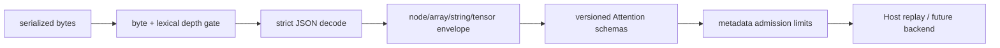

# Attention Trace/Corpus JSON Envelope

> 状态：Envelope policy v1  
> 日期：2026-08-19  
> 范围：外部 JSON 在 Attention schema/tensor/plan 构造前的资源与语法门禁

## 1. 与 metadata limits 的区别

`AttentionMetadataLimits` 限制一个语义合法 workload 的 batch、token、page 和 mask 资源；
它执行时 JSON 已经解析为 Python 对象。外部 trace/corpus 还需要更早的 envelope，否则攻击者
可用深度嵌套、重复 key、巨大数组或虚假 tensor shape 在 plan gate 之前消耗内存/CPU。

这两套 limits 不能互相替代。

## 2. Strict JSON

`decode_attention_json()`：

- 按 UTF-8 编码后的 byte 数限制输入，而不是 Python 字符数；
- 在递归 JSON parser 运行前进行 string-aware lexical nesting 扫描；
- 使用 `object_pairs_hook` 拒绝任意层级的重复 object key；
- 拒绝 Python JSON parser 默认接受的裸 `NaN`、`Infinity`、`-Infinity`；
- 非有限 tensor 数值仍必须使用 trace v1 的显式
  `{"nonfinite":"nan/+inf/-inf"}` 编码。

字符串中的 `[`、`{` 及转义引号不会被误计为结构深度。

## 3. v1 默认 limits

| 维度 | 默认值 | 检查时点 |
| --- | ---: | --- |
| serialized bytes | 16 MiB | decode 前 |
| nesting depth | 64 | decode 前并在 decode 后复核 |
| decoded nodes | 2,000,000 | schema 构造前 |
| 单 array items | 1,000,000 | schema 构造前 |
| 单 object fields | 128 | schema 构造前 |
| 单 string/key bytes | 1 MiB | schema 构造前 |
| corpus cases | 4,096 | corpus 构造前 |
| tensors | 32,768 | tensor 构造前 |
| tensor rank | 16 | tensor 构造前 |
| 单 tensor elements | 8,000,000 | tensor 构造前 |
| 所有 tensor elements | 16,000,000 | tensor 构造前 |

Tensor 识别基于 `shape/data/dtype/device` envelope。元素预算取 claimed shape product 与实际
data length 的较大者，因此用巨大 shape 配空 data 不能绕过 gate；随后原有
`ReferenceTensor` schema 再证明 shape 与 data length 严格相等。

limits 是可注入、版本化对象。CLI 的 `--max-bytes` 只收紧同一个 envelope 的 byte 字段，
不再形成一套与库 API 分离的检查。

## 4. 明确边界

v1 使用标准库 `json`，适合当前至多 16 MiB 的 Host conformance artifact，不是通用流式大
tensor 格式。未来大规模 benchmark 数据应使用带独立 checksum、shape table 和流式预算的
二进制容器，不应简单提高所有默认值。

Envelope 只限制资源和 JSON 表达；它不验证 Attention 数学、quantization、alias、runtime
环境或制品真实性。外部服务还应在 HTTP/RPC 层设置更早的 body/time/rate limits。
