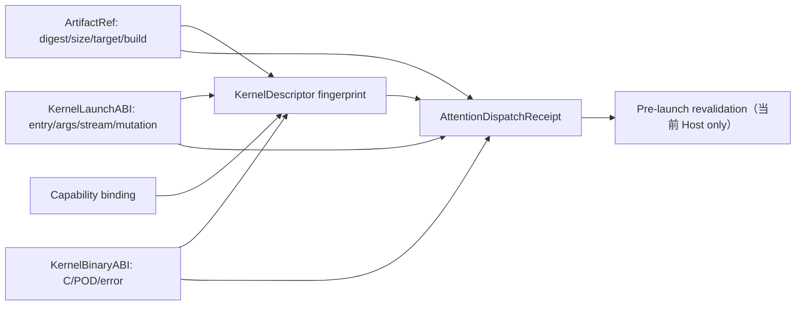

# Attention Kernel Artifact 与 Launch ABI 契约

> 状态：Kernel manifest v3 / artifact protocol v1 / binary ABI v1  
> 日期：2026-08-20  
> 范围：Host 侧 provenance、内容身份和 launcher 参数协议；当前没有真实 Ascend artifact

## 1. 为什么裸路径不够

旧 `KernelDescriptor.artifact: str` 只能说明某个路径或 builtin 名称，不能回答：

- 文件内容是否就是 capability/evidence 审核时的制品；
- artifact 针对哪个 SoC、由哪个 build 产生；
- AOT object、shared library、JIT source 和 aclnn builtin 如何区分；
- launcher 应调用哪个 entry point、按什么顺序传递参数；
- metadata、pointer width、stream 和 mutation ABI 是否兼容。

Kernel manifest v3 因此禁止裸字符串 artifact。所有非 reference descriptor 必须同时携带
`ArtifactRef`、`KernelLaunchABI` 和 `KernelBinaryABI`；reference descriptor 则禁止伪造
这三个字段。

## 2. `ArtifactRef`

`ArtifactRef` v1 固定：

- kind：`file`、`jit_source` 或 `builtin`；
- format：`ascendc_object`、`shared_library`、`ascendc_source` 或 `aclnn_builtin`；
- locator、SHA-256 digest、target SoC、build id；
- file/source 的精确 byte size；builtin 不声明虚假的文件大小。

Backend 与格式是封闭映射：

| Backend | 允许格式 |
| --- | --- |
| `ascendc_aot` | Ascend C object / shared library |
| `ascendc_jit` | Ascend C source |
| `aclnn` | aclnn builtin provider contract |
| `reference` | 无 artifact |

File/source locator 必须是规范化 POSIX 相对路径，拒绝绝对路径、`..`、`./` 和反斜杠。`verify_file()` 在解析 symlink 后再次确认目标仍位于 package root 内，再比较 size 和 digest。`verify_bytes()` 可用于 JIT/cache payload。

Builtin digest 表示 provider contract/probe record 的 identity，不表示存在可哈希的本地二进制；因此 builtin 禁止调用 byte verifier。未来真实 aclnn adapter 必须把该 digest 绑定到精确 CANN environment 和已执行的 symbol/behavior probe。

## 3. `KernelLaunchABI`

Launch ABI v1 固定：

- ABI name 和 entry point；
- 有序且唯一的 argument names；
- mutable arguments 必须是参数集合的子集；
- stream argument 必须显式出现在参数序列中；
- pointer width 与 metadata schema version。

Attention capability validator 要求 ABI name 为 `flashinfer_npu.attention.v1`，并精确包含：

```text
q, kv, aux, run_options, out, lse, plan_metadata, plan_metadata_nbytes,
float_workspace, float_workspace_nbytes,
int_workspace, int_workspace_nbytes, stream
```

`KernelBinaryABI` 进一步冻结 C calling convention、`int32` error return、64-bit pointer/value、
参数方向/nullability/alignment、POD layout 和 error code。逻辑与 binary 参数顺序、mutation
set、opaque stream 必须精确一致。Attention v1 的 POD 与地址租约详见
[`attention_launcher_abi.md`](attention_launcher_abi.md)。
从这些合同生成完整 13 参数记录、区分 Host descriptor 与 NPU tensor memory domain 的规则见
[`attention_launch_packet.md`](attention_launch_packet.md)。
Artifact bytes/builtin contract 验证、provider probe、resolved symbol 和 unload 引用生命周期见
[`attention_launcher_provider.md`](attention_launcher_provider.md)。

## 4. 与 capability 和 dispatch 的绑定

Artifact、logical launch ABI 和 binary ABI 都进入 `KernelDescriptor.fingerprint`。Attention
validator 还要求 `ArtifactRef.target_soc` 与 capability profile 的 exact SoC 相同。
`AttentionDispatchReceipt` 额外保存三者 fingerprint；receipt 重验证会逐一比较，而不是只
相信外层 kernel fingerprint。



## 5. 当前边界

Host tests 已验证 schema round-trip、payload size/digest、package-root 与 symlink escape、
builtin/file 区分、logical/binary ABI mutation、POD byte layout、error ABI、backend/format
mapping、Attention target/ABI gate、旧 manifest rejection、地址租约和 receipt mutation。

Packaged kernel manifest v3 仍为 `kernels=[]`。因此这些测试只证明未来制品不能绕过
provenance/ABI 合同，不证明任何 Ascend object、shared library、JIT compiler、aclnn symbol
或设备 launcher 已存在或可运行。
