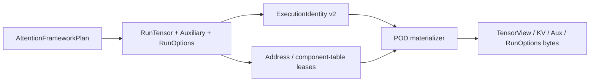

# Attention Auxiliary 与 POD 物化契约

> 状态：Host launch binding v1.1  
> 日期：2026-08-21  
> 范围：纯 Host 校验与 byte materialization；不读取设备、不调用 NPU runtime

## 1. 目的

二进制 ABI 已冻结 `q`、`kv`、`aux` 和 `run_options`，但 C struct 定义本身不能证明
Python/Torch 侧传入的角色、地址和生命周期正确。本契约补上从框架语义到 POD bytes 的唯一
路径：



物化器只消费已验证的 `TensorView` 与 `AttentionStorageLease`。它不接受无法追踪
allocation generation 的裸地址，也不加载 artifact 或 launch kernel。

## 2. Auxiliary role

component 按稳定 role code 升序排列，重复、乱序和未知角色均失败。

| Role | Plan 约束 | Shape / dtype | Access |
| --- | --- | --- | --- |
| `CUSTOM_MASK` | 有 custom-mask plan 时必需，否则禁止 | `(mask.numel,)`；packed=`uint8`，unpacked=`bool` | input/read-only |
| `Q_SCALE` | 可选 | `(num_qo_heads,)`，`float32/float64` | input/read-only |
| `K_SCALE` | 可选 | `(num_kv_heads,)`，`float32/float64` | input/read-only |
| `V_SCALE` | 可选 | `(num_kv_heads,)`，`float32/float64` | input/read-only |
| `PROFILER` | `use_profiler=True` 时必需，否则禁止 | non-empty rank-1 `uint64` | output/writable |
| `ALIBI_SLOPES` | 只允许 ALIBI plan；省略时使用确定性默认 slopes | `(num_qo_heads,)`，`float32/float64` | input/read-only |

逐 head scale 存在时替代同名 scalar；不与 scalar 相乘。这样 FlashInfer 的
scalar-or-tensor 输入在 ABI 上只有一种解释。

## 3. Run options

`AttentionRunOptions` 固定四个 finite `float64` scalar：Q/K/V scale 与 run-time
`logits_soft_cap`。soft cap 不得为负；非零 runtime cap 只允许用于 plan-time 已启用 cap 的
workload。v1 flags 必须为零，reserved bytes 由 `CStructABI.pack()` 强制清零。

`pack()` 与 `from_bytes()` 精确对应 64-byte
`FlashInferNpuAttentionRunOptionsV1`。scalar 或 auxiliary scale、mask、profiler 的结构变化都会
进入 execution identity；捕获复用不能忽略它们。

## 4. TensorView POD

`materialize_attention_tensor_view()` 要求 `AttentionAddressBinding.view` 与 lease 的 storage id、
device、capacity、writable 和 alignment 已精确匹配，再产生 176-byte POD。物化结果固定：

- leased effective data address；
- storage capacity 与 element offset；
- rank≤8 的 shape/stride，尾部必须为零；
- dtype、role、device ordinal；
- 从 view 推导且不可伪造的 contiguous/writable/empty flags。

严格解包会拒绝未知 enum/flag、非 canonical flag、非零 reserved、非零尾部 shape/stride、空指针
非空 tensor 以及越界 storage offset。解包结果是 POD record，不伪造原始 allocator identity。

## 5. KV 与 auxiliary component table

KV component 顺序固定：

```text
packed: KV_PACKED_STORAGE
dense:  KV_KEY_STORAGE, KV_VALUE_STORAGE
quant:  KV_KEY_STORAGE, KV_KEY_SCALE, [KV_KEY_ZERO_POINT],
        KV_VALUE_STORAGE, KV_VALUE_SCALE, [KV_VALUE_ZERO_POINT]
```

量化 KV descriptor 同时绑定完整 `QuantSpec.fingerprint`；dense/packed 使用 32-byte zero digest。
component table 本身必须有独立 writable `AttentionHostBufferLease`，容量至少为
`component_count * 176`、Host 地址非零且 alignment≥8。它不是 NPU tensor storage lease。空
auxiliary table 是唯一例外：descriptor 仍存在，但 table pointer/count 为 `0/0`，并使用空
Host lease。

地址 binding 的稳定角色名是 `q`、`kv.key_storage`、`kv.key_scale`、
`kv.key_zero_point`、对应的 `kv.value_*`、`kv.packed_storage`、`aux.custom_mask`、
`aux.q_scale`、`aux.k_scale`、`aux.v_scale`、`aux.profiler` 与 `aux.alibi_slopes`。

### 5.1 KV POD v2

v1 的 64-byte ABI 与 fingerprint 保持冻结。新增的 192-byte
`FlashInferNpuKVCacheViewV2` 只改变 `kv` pointee ABI，十三个逻辑参数及 mutation direction
不变。v2 额外绑定 physical-layout access、descriptor/catalog、Host layout binding 和 dispatch
receipt fingerprint。

非逻辑量化 KV 只能选择 `KERNEL_NATIVE`，且必须提供由 exact profile/rule/environment、kernel、
evidence 和 receipt 构造的 `AttentionKVPhysicalLayoutBinding`。缺 catalog、错误 feature、旧 receipt、
descriptor 漂移、v1 ABI 或仅有 conversion plan 均失败。当前 v2 POD 尚未进入
`AttentionLaunchPacket`/provider；这部分证据只证明 pre-launch byte contract，不代表可提交设备。

## 6. Identity 与 storage lease

Execution identity v2 显式增加 `auxiliary_fingerprint` 与 `run_options_fingerprint`，tensor structural
signature 也包含 auxiliary role/view 和 run-options payload。前者提供精确 mismatch 诊断，后者
保证整体 ABI hash 自包含。auxiliary fingerprint 与 tensor signature 一样排除 storage id、地址和
allocation generation，使结构相同的新 allocation 可以复用 Host contract；这些实时属性只由
launch lease 约束。

`AttentionLaunchLeaseContract.validate_tensor_contract()` 要求每个 runtime TensorView role 恰好有
一个 address binding，拒绝 missing、extra、view mismatch、stream mismatch 或 identity mismatch。
component-table Host lease 独立于 TensorView device lease，因为它描述 C launcher 读取的
descriptor 数组 allocation。完整 13 参数 ownership 汇总见
[`attention_launch_packet.md`](attention_launch_packet.md)。

## 7. 当前证据边界

Host 测试覆盖 role/shape/dtype/access/plan rejection、run-options 64-byte round-trip、reserved 与
trailing entry rejection、dense KV/empty aux/non-empty aux 物化、component lease 容量、地址 role
缺失、辅助 output alias、storage lease exact binding、capture scalar mutation，以及 KV POD v2 的
字段偏移/fingerprint、native-layout evidence、round-trip/tamper 和 v1 compatibility。

这些测试没有解析真实 `torch.Tensor.data_ptr()`，没有调用 allocator、aclrt stream/event、CANN、
Ascend C 或 NPU。首个设备 adapter 必须提供真实地址与 generation 证据后才能复用此物化层。
