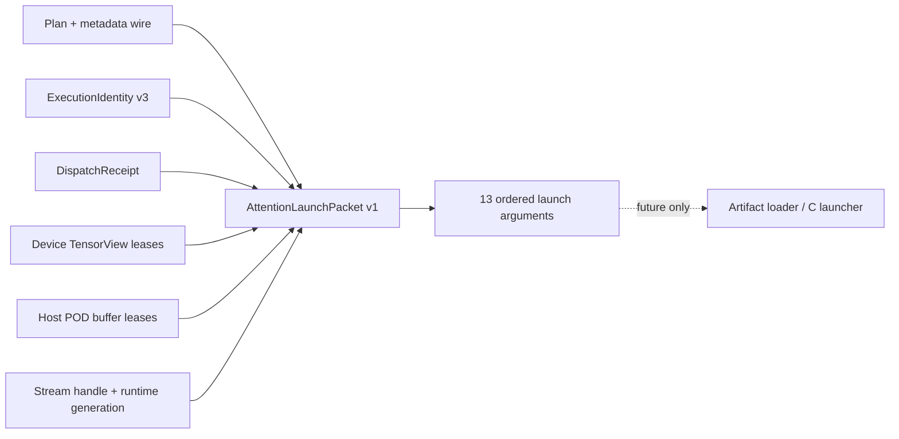

# Attention Launch Packet 与完整所有权契约

> 状态：Host launch packet v1  
> 日期：2026-08-20  
> 范围：构造未来 launcher 所需的完整 Host 提交记录；不加载 artifact、不调用 CANN/NPU

## 1. 解决的问题

Plan metadata wire、TensorView POD、KV/aux component table、execution identity 和 storage lease
分别正确，并不自动保证一次 launch 正确。实际提交还可能发生以下部分换绑：

- KV descriptor 仍指向旧 component table；
- metadata 内容属于另一个 plan/dispatch；
- run-options scalar 与 capture identity 不一致；
- workspace pointer、capacity 和 dispatch requirement 不一致；
- Host descriptor 地址被当成 NPU tensor 地址；
- stream handle 已重建，但仍沿用旧 runtime generation；
- `lse=null`，但 Host buffer 集合仍残留旧 descriptor。

`AttentionLaunchPacket` 把这些独立合同汇总为一个 canonical、可序列化、可哈希的提交记录。



## 2. 两个不可混用的内存域

### Device tensor lease

`AttentionStorageLease` 与 `AttentionAddressBinding` 用于 Q、KV storage/scale/zero-point、auxiliary
tensor、out/LSE 和 float/int workspace。它绑定 device、allocator、storage id、base address、
capacity、allocation generation、alignment、writable 和 lifetime。

### Host descriptor lease

`AttentionHostBufferLease` 只用于进程内 C ABI bytes：

- Q/out/LSE TensorView descriptor；
- KV/aux descriptor 与 component arrays；
- 64-byte run-options；
- canonical plan metadata blob。

它绑定 Host address、capacity、owner、allocation generation、alignment、writable、pinned 和
lifetime。Host lease 没有 NPU device 字段，device lease 也不能代替 Host lease。v1 materializer
会在类型层直接拒绝跨域替换。

Host pointer 表示 C launcher 在调用边界读取的进程地址；TensorView POD 内部的 `data_ptr` 才是
未来 kernel 使用的 NPU allocation address。真实 launcher 必须在同步返回前完成 descriptor
解析或复制；若 backend 异步读取 Host bytes，则对应 Host lease 必须一直保留到 completion event。

## 3. Canonical Host buffer roles

| Role | Content | 是否固定存在 |
| --- | --- | --- |
| `q_descriptor` | 176-byte TensorView POD | 是 |
| `kv_descriptor` | 64-byte KV POD | 是 |
| `kv_components` | `N × 176` TensorView POD | 是，非空 |
| `aux_descriptor` | 32-byte aux POD | 是 |
| `aux_components` | `N × 176` TensorView POD | 是；无 auxiliary 时为 null/zero empty lease |
| `run_options` | 64-byte run-options POD | 是 |
| `out_descriptor` | 176-byte TensorView POD | 是 |
| `lse_descriptor` | 176-byte TensorView POD | 仅 `lse != null` |
| `plan_metadata` | canonical metadata wire | 是 |

角色集合必须精确匹配，不接受 missing、extra 或重复 role。同一 Host owner 的非空 buffer
interval 不得重叠。graph packet 的所有 Host/device lease 都必须是 `persistent` 或 `capture`
lifetime。

## 4. Stream binding

`AttentionStreamBinding` 固定：

- logical device 与 device ordinal；
- stable stream id 与非零 opaque stream handle；
- runtime/provider id；
- runtime generation。

stream id、device 和 handle 分别与 tensor contract、launch lease 和最终 argument 交叉校验。
packet 还会从 `device + stream_id + ordered=True` 重算独立 stream-context fingerprint，并与
execution identity v3 比较；因此同时修改 lease stream id、binding 与 handle 也不能换绑旧 identity。
runtime generation 进入 packet fingerprint，runtime 重建后即使 handle 数值巧合相同，也不会
被视为同一 packet。

## 5. 13 个最终参数

`AttentionLaunchArguments` 按 binary ABI 顺序精确保存：

```text
q, kv, aux, run_options, out, lse, plan_metadata, plan_metadata_nbytes,
float_workspace, float_workspace_nbytes,
int_workspace, int_workspace_nbytes, stream
```

Q/KV/aux/run-options/out/metadata/stream 不可为零。LSE 可以为零；两块 workspace 必须满足
`pointer == 0` 当且仅当 `nbytes == 0`。packet 进一步校验：

- descriptor argument 等于对应 Host lease address；
- KV/aux 内部 `components_ptr` 等于 component Host lease address；
- plan metadata byte count 等于实际 canonical blob 长度；
- metadata 的 plan/admission/dispatch/binary ABI fingerprint 与 identity/receipt 一致；
- run-options fingerprint 与 execution identity 一致；
- 每个 TensorView POD 可从对应 device address binding 重新物化且 byte-exact；
- workspace 是 contiguous writable rank-1 `uint8`，capacity 不小于 receipt requirement，并满足
  backend alignment；
- device binding role set 与 descriptor tree 完全相同。

## 6. Materialization gate

`materialize_attention_launch_packet()` 只接受 kernel-bound execution identity。它要求：

1. identity 与 plan、tensor structural signature、auxiliary 和 run-options 一致；
2. dispatch receipt 与 plan 一致且使用 canonical Attention binary ABI；
3. launch lease 精确绑定 identity fingerprint、receipt fingerprint、全部 TensorView 和 stream；
4. kernel launch 具有 caller-owned out；`return_lse=True` 时也必须有 caller-owned LSE；
5. Host lease role set 与 nullable 参数组合一致；
6. 物化后的 packet 自身再次执行全部交叉校验。

Packet 的 dict round-trip 包含完整 identity、receipt、device leases、Host leases、Host content hex、
stream binding 和 arguments。解码限制单个/总 Host content 为 128 MiB，防止未受限构造。

## 7. 当前证据与未完成项

Host tests 已覆盖：

- 完整 13 参数 packet round-trip 与稳定 fingerprint；
- quantized KV descriptor/component ownership；
- nullable LSE 的 canonical role set；
- metadata 和 run-options content mutation；
- component pointer 与 workspace pointer 部分换绑；
- Host/device lease 类型隔离；
- stream runtime generation 与 Host allocation generation 对 packet identity 的影响。
- coordinated stream-id/lease/handle drift 仍被 execution identity v3 拒绝。

这些地址均为 Host 测试中的合成地址，没有解引用，也没有执行 artifact。首个真实 backend 前仍需：

1. torch_npu/ACL adapter 提供真实 tensor、allocator、stream 和 event 证据；
2. 明确每类 launcher 是否同步复制 Host descriptor；
3. artifact loader 把 packet 与实际 symbol 调用和同步错误码关联；
4. completion event 将 device/必要 Host lease 保留到异步完成。

上述 artifact/symbol/provider/error/event 生命周期现已由 Host-only 协议冻结，见
[`attention_launcher_provider.md`](attention_launcher_provider.md)；该协议当前仍只使用 fake
provider，不改变本节的“无真实 runtime”边界。
