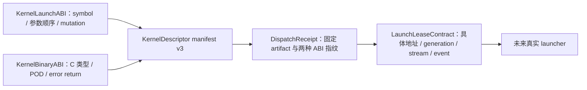
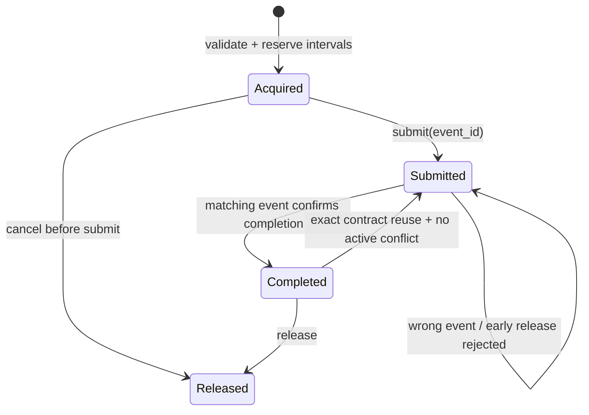

# Attention Launcher 二进制 ABI 与地址租约

> 状态：Framework binary ABI v1+v2 / storage lease v1  
> 日期：2026-08-21  
> 范围：Host 侧可序列化协议与失败门禁；不包含 Ascend C、aclrt、aclnn 或设备执行

## 1. 协议分层

Attention launcher 不把 Python 对象、Torch tensor 或 allocator 对象直接交给未来内核。一次
launch 由四层相互校验的合同组成：



- `KernelLaunchABI` 是逻辑接口，便于 registry、manifest 和 dispatch 做结构比较。
- `KernelBinaryABI` 是二进制接口，固定 C calling convention、64-bit pointer、参数 primitive、
  输入输出方向、nullability、alignment、POD 指纹和 `int32` error return。
- `AttentionDispatchReceipt` 固定所选 artifact、逻辑 ABI 和二进制 ABI 指纹。
- `AttentionLaunchLeaseContract` 在单次提交前绑定真实 storage 地址、allocation generation、
  stream 与完成事件生命周期。

任何一层指纹变化都要求重新构造下游合同；不能只比较 kernel id 或 Python 函数名。

## 2. Attention binary entry

概念上的 C 签名如下。真实导出 symbol 来自 descriptor 的 `KernelLaunchABI.entry_point`；这里
只冻结参数边界，不声明已经存在该函数。

```c
int32_t attention_entry(
    const FlashInferNpuTensorViewV1* q,
    const FlashInferNpuKVCacheViewV1* kv,
    FlashInferNpuAttentionAuxiliaryViewV1* aux,
    const FlashInferNpuAttentionRunOptionsV1* run_options,
    FlashInferNpuTensorViewV1* out,
    FlashInferNpuTensorViewV1* lse,
    const FlashInferNpuAttentionPlanHeaderV1* plan_metadata,
    uint64_t plan_metadata_nbytes,
    void* float_workspace,
    uint64_t float_workspace_nbytes,
    void* int_workspace,
    uint64_t int_workspace_nbytes,
    uint64_t stream);
```

参数顺序不可交换：

```text
q, kv, aux, run_options, out, lse, plan_metadata, plan_metadata_nbytes,
float_workspace, float_workspace_nbytes,
int_workspace, int_workspace_nbytes, stream
```

`lse`、零容量 float workspace 和零容量 int workspace 可以是 null；其余 pointer 不可
为 null。`aux` 是 logical mutable，因为 component table 可同时包含 input mask/scale 与 output
profiler，但 descriptor 本身由 launcher 只读。两块 workspace 地址对齐至少为 32 bytes。
所有 `*_nbytes` 均为 `uint64_t`，`stream` 是非 null 的 64-bit opaque handle。

## 3. POD layout v1

所有 POD 使用 little-endian、8-byte struct alignment、自然字段对齐和显式 fixed-width
primitive。reserved bytes 必须为零。字段增加、类型改变、顺序改变或复用 reserved bytes
都必须发布新的 ABI 名称和 schema version。

### 3.1 `FlashInferNpuTensorViewV1`

总大小 176 bytes，最大 rank 为 8。

| Offset | 字段 | C 类型 | 含义 |
| ---: | --- | --- | --- |
| 0 | `data_ptr` | `uint64_t` | view 的有效数据地址 |
| 8 | `storage_nbytes` | `uint64_t` | 底层 allocation 容量 |
| 16 | `storage_offset_elements` | `uint64_t` | 相对 storage 的 element offset |
| 24 | `shape` | `int64_t[8]` | 逻辑 shape |
| 88 | `strides` | `int64_t[8]` | element stride |
| 152 | `ndim` | `uint32_t` | 有效 rank |
| 156 | `dtype_code` | `uint16_t` | 稳定 dtype enum |
| 158 | `role_code` | `uint16_t` | Q/K/V/scale/zero/out/LSE 角色 |
| 160 | `flags` | `uint32_t` | contiguous/writable 等版本化 bitset |
| 164 | `device_index` | `int32_t` | device ordinal |
| 168 | `reserved` | `uint32_t` | 必须为零；尾部 padding 至 176 bytes |

dtype code v1 为 bool=1、int8=2、uint8=3、int32=4、int64=5、float16=6、
bfloat16=7、float32=8、float64=9、float8_e4m3fn=10、float8_e5m2=11、int16=12、
uint16=13、uint32=14、uint64=15、INT4=16、INT4_PACKED=17、UINT4_PACKED=18。

### 3.2 `FlashInferNpuKVCacheViewV1`

总大小 64 bytes。`components_ptr` 指向连续的 `FlashInferNpuTensorViewV1` 数组，
`component_count` 给出数组长度。dense、分离 K/V、packed KV 与量化 KV 使用 role code 区分；
量化 storage、scale 和可选 zero-point 都是独立 component，不允许把多个设备地址塞进一个
未定义的 `void*`。`quant_spec_fingerprint[32]` 固定完整 QuantSpec，而不只固定 storage dtype。

| Offset | 字段 | C 类型 |
| ---: | --- | --- |
| 0 | `components_ptr` | `uint64_t` |
| 8 | `component_count` | `uint32_t` |
| 12 | `layout_code` | `uint16_t` |
| 14 | `flags` | `uint16_t` |
| 16 | `quant_spec_fingerprint` | `uint8_t[32]` |
| 48 | `reserved` | `uint8_t[16]` |

### 3.2.1 `FlashInferNpuKVCacheViewV2`

v2 总大小 192 bytes；v1 结构和 fingerprint 不变。十三参数顺序也不变，只有 `kv` pointee
从 V1 切换到 V2，因此 binary ABI 使用独立名称 `flashinfer_npu.attention.binary.v2`。

| Offset | 字段 | C 类型 |
| ---: | --- | --- |
| 0 | `components_ptr` | `uint64_t` |
| 8 | `component_count` | `uint32_t` |
| 12 | `layout_code` | `uint16_t` |
| 14 | `flags` | `uint16_t` |
| 16 | `physical_layout_access_code` | `uint16_t` |
| 18 | `reserved_header` | `uint8_t[6]` |
| 24 | `quant_spec_fingerprint` | `uint8_t[32]` |
| 56 | `physical_layout_descriptor_fingerprint` | `uint8_t[32]` |
| 88 | `physical_layout_catalog_fingerprint` | `uint8_t[32]` |
| 120 | `physical_layout_binding_fingerprint` | `uint8_t[32]` |
| 152 | `dispatch_receipt_fingerprint` | `uint8_t[32]` |
| 184 | `reserved` | `uint8_t[8]` |

`LOGICAL` access 要求四个 physical-layout/dispatch digest 全为零；`KERNEL_NATIVE` 要求量化、
physical-layout flag 以及四个非零 digest 同时存在。当前不定义“converter plan 即执行成功”的
access code；转换计划没有 artifact、output lease 和 completion evidence，不能进入 launch ABI。

### 3.3 `FlashInferNpuAttentionAuxiliaryViewV1`

总大小 32 bytes。它指向连续 TensorView component table；role code 固定 custom mask、Q/K/V
scale、profiler 和 ALiBi slopes。mask/scale/slopes 是 input，profiler 是 output。空表仍使用非
null descriptor 和 `component_count=0`，避免 optional 参数组合改变函数签名。

### 3.4 `FlashInferNpuAttentionRunOptionsV1`

总大小 64 bytes，固定 scalar `q_scale`、`k_scale`、`v_scale`、run-time
`logits_soft_cap`、flags 和 zero reserved。存在对应 per-head auxiliary scale tensor 时，由其
提供逐 head 值并替代同名 scalar；两者不相乘。scalar 仍是显式、可审计的 fallback，而不是
Python 默认值猜测。Host role/shape/access 校验和 POD byte 物化见
[`attention_launch_binding.md`](attention_launch_binding.md)。

### 3.5 `FlashInferNpuAttentionPlanHeaderV1`

总大小 160 bytes。header 后的 payload 是独立版本化的 plan metadata；header 的
`payload_nbytes` 与 launch 参数 `plan_metadata_nbytes` 必须在物化阶段交叉校验，避免截断、
越界或复用旧 metadata。

| Offset | 字段 | C 类型 |
| ---: | --- | --- |
| 0 | `schema_version` | `uint32_t` |
| 4 | `mode_code` | `uint16_t` |
| 6 | `flags` | `uint16_t` |
| 8 | `payload_nbytes` | `uint64_t` |
| 16 | `plan_fingerprint` | `uint8_t[32]` |
| 48 | `admission_fingerprint` | `uint8_t[32]` |
| 80 | `dispatch_fingerprint` | `uint8_t[32]` |
| 112 | `binary_abi_fingerprint` | `uint8_t[32]` |
| 144 | `reserved` | `uint8_t[16]` |

header 后的 canonical config/directory/section 格式见
[`attention_plan_metadata_wire.md`](attention_plan_metadata_wire.md)。

## 4. Error ABI

导出函数同步返回 `int32_t`。v1 code 是封闭集合：

| Code | 名称 | 语义 |
| ---: | --- | --- |
| 0 | `success` | launch 请求已被接受；不等于异步设备执行完成 |
| 1 | `invalid_argument` | 参数/POD/shape/stride 不合法 |
| 2 | `unsupported` | 当前 kernel 不支持该合法 workload |
| 3 | `workspace_too_small` | 任一独立 workspace 容量不足 |
| 4 | `artifact_mismatch` | artifact identity 不匹配 |
| 5 | `abi_mismatch` | schema/POD/ABI fingerprint 不匹配 |
| 6 | `launch_failure` | 同步提交失败 |
| 7 | `resource_busy` | 可重试的资源占用冲突 |
| 8 | `async_failure` | 由 completion/event 路径归属的异步失败 |

未知 code 不得静默映射成 success。`success` 后仍必须保留租约，直到拥有该提交的完成事件
确认 completion；异步错误也由该事件路径报告，而不是提前释放地址。

## 5. Storage/address lease v1

`TensorView.storage_id` 只用于单次 Host alias 判断，不能证明设备地址稳定。因此 launch 前
还需要 `AttentionStorageLease`：

- exact `base_address`、`capacity_bytes`、power-of-two alignment；
- allocator id 与单调 `allocation_generation`，阻止地址被释放后恰好重用造成 ABA；
- `run`、`persistent` 或 `capture` lifetime；
- storage/device/writable identity。

`AttentionAddressBinding` 把 lease 与 TensorView role 绑定，并验证 storage id、device、容量、
effective address alignment、bounds 和 writable 权限。`AttentionLaunchLeaseContract` 再固定：

- execution identity fingerprint；
- dispatch receipt fingerprint；
- ordered stream device/id；
- 全部 tensor、metadata 与 workspace address bindings；
- graph-enabled lifetime policy。

`validate_tensor_contract()` 进一步要求 runtime contract 的每个稳定 role 恰好出现一次，拒绝
missing/extra role、TensorView 不一致、stream 不一致或 execution identity 不一致。KV/aux 的
TensorView descriptor 数组拥有独立 Host component-table lease，不能从某个 NPU tensor 地址
推断。Host descriptor lease 与 device tensor lease 的内存域拆分，以及最终 13 参数 packet 见
[`attention_launch_packet.md`](attention_launch_packet.md)。
同步 error code、completion event、`submit_unknown` 与 resolved-symbol lifetime 的 provider
协议见 [`attention_launcher_provider.md`](attention_launcher_provider.md)。

同 allocator 的 byte interval 若重叠且任一 view 可写，launch 必须在提交前拒绝。图执行只
接受 `persistent`/`capture` lease；`run` lifetime 不能被提升为图地址稳定证据。



旧 contract 与候选 contract 的 fingerprint 必须完全相同。地址、capacity、generation、
lifetime、stream、receipt 或 execution identity 任一变化都视为 stale。已完成的旧 lease
若与后来 acquired 的可写区间冲突，也不能再次提交。

## 6. Manifest 与接入门禁

Kernel manifest v3 的非 reference descriptor 必须同时具有：

1. `ArtifactRef`：制品 provenance、digest、size、SoC 与 build identity；
2. `KernelLaunchABI`：entry point、逻辑参数顺序和 mutation set；
3. `KernelBinaryABI`：C primitive/POD/error ABI；
4. capability binding 与独立 float/int workspace formula。

Attention validator 接受严格配对的 logical/binary ABI v1 或 v2，并要求逻辑参数顺序、mutable
set 和 opaque stream 与 binary ABI 一致。包含任一非逻辑 `QuantSpec` 的 capability rule 必须绑定
v2；v1 会明确失败。当前 packaged manifest 仍
为 `kernels=[]`；租约 registry 也只是 Host 状态机，不读取真实地址、不创建事件、不调用
aclrt/aclnn。因此这些证据只说明协议能拒绝已知错误，不说明存在可运行的 NPU backend。
