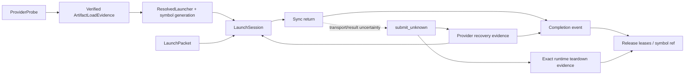
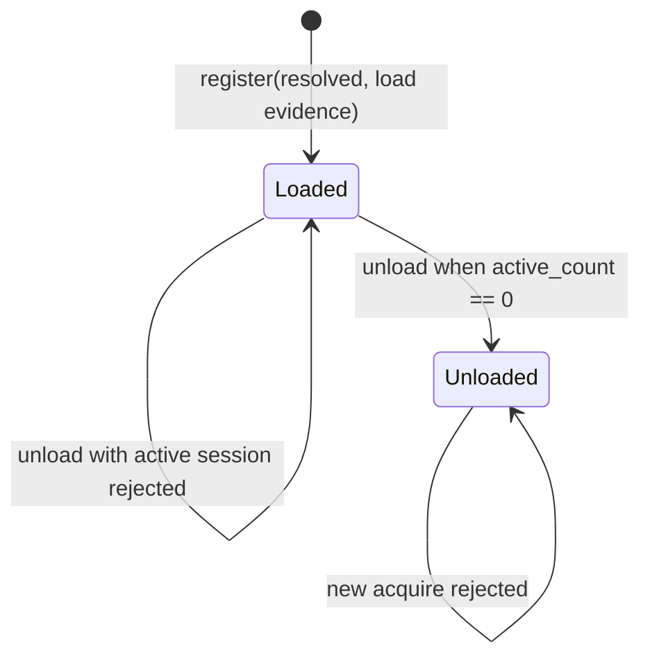

# Attention Artifact Loader 与 Launcher Provider 协议

> 状态：Host provider protocol v1  
> 日期：2026-08-20  
> 范围：可验证的 loader/launcher 生命周期；当前不提供或执行 NPU artifact

## 1. 目的

完整 launch packet 仍不能证明某个函数地址来自正确 artifact，也不能决定同步返回码、异步 event
和 allocation/symbol lifetime 的归属。本协议在 packet 与未来 CANN/Ascend provider 之间增加四层，
并为“调用已经越过 Host 边界、但返回结果丢失”定义可恢复状态：



当前实现只冻结 Host 协议，不包含 `dlopen`、Ascend C object loader、aclnn symbol lookup、
`aclrtLaunchKernel` 或真实 event query。

## 2. Provider probe

`AttentionProviderProbe` 是一次 exact runtime probe record，固定：

- provider id/version；
- 单一 backend；
- exact `AttentionRuntimeEnvironment.fingerprint`；
- 明确且唯一的 artifact format 集合；
- canonical binary ABI 与 error ABI fingerprint；
- C calling convention 和 64-bit pointer width。

Probe 不接受“CANN ≥ x”一类宽泛声明。dispatch receipt 的 environment、descriptor backend、
artifact format、binary/error ABI 任一不匹配，symbol resolution 在调用 provider 前失败。

## 3. Artifact load evidence

`AttentionArtifactLoadEvidence` 不提供可伪造的 `verified=True` 字段，只能通过两个构造路径产生：

### Byte artifact

`verify_bytes()` 调用 `ArtifactRef.verify_bytes()`，精确比较 payload size 与 SHA-256。适用于 AOT
file/object 和 JIT source bytes。证据记录 loader instance/generation 和非零 artifact handle。

### Builtin provider contract

`verify_builtin_contract()` 只允许 `ArtifactKind.BUILTIN`，要求 provider-contract digest 与
`ArtifactRef.digest` 完全相同，并禁止声明不存在的 byte size。

两类证据不可互换。load evidence fingerprint 绑定 artifact、probe、验证方式、loader generation
和 artifact handle。

## 4. Resolved symbol

`resolve_attention_launcher()` 将以下证据交叉绑定：

- `KernelDescriptor` 的 kernel/artifact/logical ABI/binary ABI；
- `AttentionDispatchReceipt` 的同名 fingerprints 与 environment；
- provider probe；
- verified load evidence；
- entry point、非零 symbol address 和 symbol generation。

结果 `AttentionResolvedLauncher` 进入 session 前还会与 launch packet 的 receipt 重新比较。
symbol address 只是 provider 给出的不透明解析结果；框架层不得解引用该地址。

## 5. Symbol lifetime registry

`AttentionResolvedLauncherRegistry` 对 resolved symbol 做引用计数：



每个 `AttentionLaunchSession` 在 device lease 之外必须同时 acquire resolved symbol token。session
未释放时不能 unload artifact/symbol；session 构造失败会回滚刚取得的 device lease。

Session 还必须从 `AttentionHostBufferRegistry` acquire packet 的完整 Host descriptor arena。任意
非空 Host interval 与 active session 重叠都会失败。v1 保守地把 Host descriptors 保留到
completion event，不假设 provider 在 `submit()` 返回前已完成复制；未来若允许更早释放，必须
由新的、可探测的 provider consumption contract 明确授权。

`AttentionLaunchCoordinator` 是进程内的所有权根，同时持有 device lease、Host-buffer 和
resolved-symbol 三个 registry。所有 session 必须由同一 coordinator 创建，不能为每次调用临时
创建 registry，否则跨 session 的地址重叠与 unload 竞争不可见。三个 registry 及 session 状态迁移
使用可重入锁保护；这只定义进程内线程安全，不声称支持 fork 后复用 runtime handle。

## 6. 同步 error ABI

Provider 的 `submit()` 返回 `AttentionProviderSubmitResult`。code 必须来自 canonical error ABI：

| Code 类别 | Session 行为 |
| --- | --- |
| `success=0` | 必须携带 submission id 与 completion event id；device lease 转为 submitted |
| `resource_busy=7` | 不得携带 event；session 保持 prepared，可用同一 packet 重试 |
| 其他同步失败 | 不得携带 event；session 进入 `failed_sync`，可安全 release |
| `async_failure=8` | 禁止作为同步返回 |
| 未知 code | schema rejection |

`success` 只表示提交被接受，不表示 tensor 已可复用。

## 7. `submit_unknown` 安全状态

调用 provider 之后，如果发生以下情况，Host 无法证明设备未接收任务：

- provider 抛异常；
- 返回对象类型错误；
- provider/probe/resolved/packet fingerprint 不匹配；
- provider 返回 success，但 Host lease registry 无法登记 event。

Session 必须进入 `submit_unknown`，禁止 release device/Host lease 和 symbol reference。把这种情况
直接退回 `prepared` 会造成重复提交或 use-after-free 风险。

`recover_submit(resolved, packet, attempt_number)` 返回严格绑定 provider、resolved symbol、packet
及当前 attempt 的 `AttentionProviderRecoveryResult`：

| 恢复状态 | 必需证据 | Session 行为 |
| --- | --- | --- |
| `indeterminate` | 不得携带 submission/event | 保持 `submit_unknown`，冻结全部所有权 |
| `not_submitted` | 不得携带 submission/event，两个 registry 仍须为 `acquired` | 回到 `prepared`，允许新 attempt |
| `submitted` | submission id + completion event id | 两类 lease 登记为 `submitted`，进入 event query |
| `completed` | submission/event + `success` 或异步错误 | 两类 lease 完成，进入 `completed`/`failed_async` |

stale attempt、身份漂移、变更的 submission/event id 或与 registry 状态矛盾的结果全部拒绝，且仍
保留所有权。device 与 Host registry 若只推进一侧，已登记的 completion event 也必须与恢复结果
逐字相同；仅状态都是 `submitted` 不足以证明同一事件所有权。恢复本身抛异常也不能推断为
`not_submitted`。

如果 provider 无法查询，只有 `AttentionRuntimeTeardownEvidence` 能强制回收 unknown/submitted
session。证据必须精确匹配 provider probe、environment fingerprint、runtime id 和 runtime
generation，并携带 teardown id/generation 与 quiescence digest。匹配后 device/Host registry 先
以该证据 fingerprint 标记 quiesced，再释放 lease 与 symbol reference。其他 runtime generation
的 reset 不能释放本 session；单纯的超时、异常文本或进程仍存活都不是 teardown 证据。

## 8. Completion event 与异步错误

已知成功提交后，`query_completion()` 只能返回：

- `success=0`，且没有 error detail；
- `async_failure=8`，且具有 error-detail SHA-256。

provider probe、resolved launcher、packet 和 event id 必须与 session 完全相同。错误 event 或 stale
result 不推进状态，lease 仍保持 submitted。匹配 event 完成后，lease registry 先转为 completed；
session 状态变为 `completed` 或 `failed_async`，随后调用者才能 release device lease 与 symbol ref。

## 9. Provider protocol

未来 backend 实现 `AttentionLauncherProvider`：

```text
probe() -> AttentionProviderProbe
submit(resolved, packet) -> AttentionProviderSubmitResult
recover_submit(resolved, packet, attempt_number) -> AttentionProviderRecoveryResult
query_completion(resolved, packet, event_id) -> AttentionProviderCompletionResult
```

Provider 必须直接消费 packet 中冻结的 13 参数，不得重新从 Python objects 推导 shape、地址或
workspace。它也不得把同步 C 返回码伪装成 completion result，或在 event 完成前释放内部 handle。

## 10. Provider 合同与未完成项

provider 合同必须覆盖：

- probe/load/resolved schema round-trip；
- bytes digest/size 与 builtin contract 两条验证路径；
- environment/format/descriptor/receipt drift rejection；
- success → submitted → completion → release；
- resource-busy retry 与 terminal synchronous failure；
- asynchronous failure 只能由匹配 completion event 报告；
- stale result、wrong event 和 provider exception；
- `submit_unknown` 禁止释放，四类恢复结果、stale attempt 与 registry 矛盾拒绝；
- exact runtime-generation teardown/quiescence 后才允许强制释放；
- active session 阻止 symbol unload，release 后才允许 unload。
- active session 阻止另一个 session 复用同一 Host descriptor arena，completion/release 后恢复。
- coordinator 共享三类 registry；8 路并发 prepare 同一冲突 packet 时仅一个 session 获准。
- 单边 registry 推进且 event 漂移时恢复拒绝；匹配 teardown 证据可安全收口。
- 阻塞 completion query 与普通 release/teardown 的确定性交错；session lock 防止提前或双重释放。
- 独立 `AttentionProtocolTrace` v1 由 context-local recorder 挂接 provider session，直接绑定
  packet、submit/recovery/completion 与 teardown evidence；未完成 unknown/submitted session 不可发布
  corpus，并拒绝 stream/resource-owner 漂移。

这些框架合同不证明任何共享库、Ascend C object、aclnn builtin 或 CANN launcher 存在。正式 provider
接入仍需要真实 runtime tuple、artifact bytes、symbol lookup、backend submission-query、真实
runtime teardown issuer、fork 策略、event query 和异步错误注入证据。

成功 provider lifecycle 可以由
[`AttentionAccuracyExecutionBinding`](attention_accuracy.md) 与 passing accuracy result 连接。
该 binding 要求 packet/launcher/probe/submit/completion/event/stream/protocol trace 身份一致，
但 `result_origin` 仍只是 runner 声明；没有可信 attestation 时不能把 synthetic binding
当作真实设备 correctness evidence。
