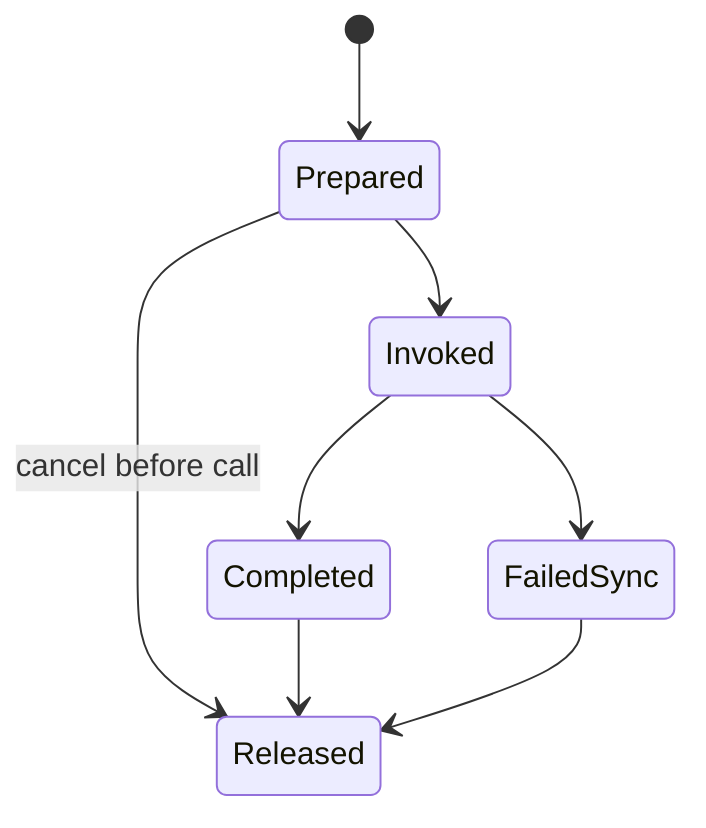
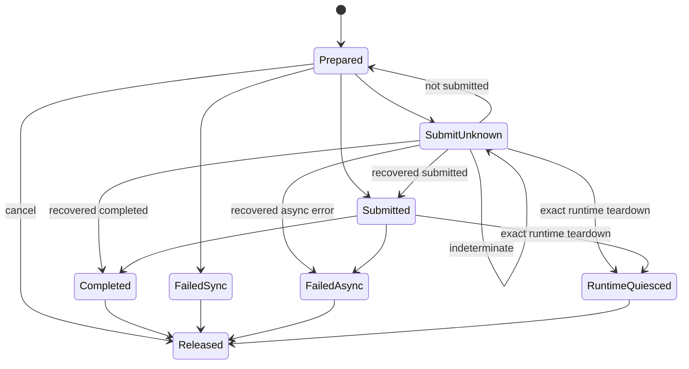

# Attention Protocol Trace

> 状态：Host protocol trace schema v1  
> 日期：2026-08-20  
> 范围：JIT/provider 生命周期与所有权采集/校验；不执行 NPU artifact

## 1. 与数值 trace 的边界

`AttentionTrace` 保存 plan、Q/K/V、量化参数和预期输出，用来证明 Attention 数学语义。
`AttentionProtocolTrace` 不保存 tensor 数据或输出，它保存一次调用的 route、状态序列、stream
指纹、资源所有权指纹和逐步证据指纹，用来回答：

- 是否走了 JIT 同步调用或 provider 异步提交的合法状态图；
- 调用过程中 stream claim 是否发生漂移；
- scratch/output 或 device/Host/symbol lease 的所有者是否发生漂移；
- submit outcome 未知时是否先恢复或 runtime quiesce，再释放资源；
- terminal path 是否最终完成 release。

两类 trace 互不替代。数值 replay 通过不能证明 lease 安全；协议 validation 通过也不能证明 Attention
输出正确，更不能证明某个 Ascend kernel 存在。

## 2. Wire schema

`AttentionProtocolTrace` v1 包含：

```text
trace_id:             human-readable unique id
route:                single_jit | provider
subject_fingerprint:  JIT call ABI 或 launch packet 的 SHA-256
events:               contiguous event array
schema_version:       1
```

每个 `AttentionProtocolEvent` 包含：

```text
sequence:                    从 0 连续递增
state:                       当前协议状态
stream_context_fingerprint:  device/stream/ordering claim 的 SHA-256
ownership_fingerprint:       本次调用全部资源 owner set 的 SHA-256
evidence_fingerprint:        触发该状态的证据 SHA-256
schema_version:              1
```

所有事件必须保持同一个 stream 与 ownership fingerprint。Trace 必须从 `prepared` 开始并以
`released` 结束；未释放的中间快照不可以伪装成完整 trace。JSON 使用 canonical key ordering，
反序列化复用 Attention bounded/strict JSON envelope，拒绝 duplicate key、非标准数值和超限输入。

## 3. Opt-in recorder 与上下文隔离

`capture_attention_protocol(capture_id)` 返回 context manager。只有显式进入该上下文时，已接线的
JIT/provider 路径才创建 `AttentionProtocolRecorder`；默认调用不产生 trace，也不维护进程级
“latest trace”。底层使用 `ContextVar`，嵌套 capture 退出后恢复外层，线程/async context 不共享
collector。

```python
with capture_attention_protocol("request-42") as capture:
    output = single_prefill_with_kv_cache_with_jit_module(module, q, k, v)

trace = capture.traces[0]
corpus = capture.to_corpus("request-42-protocol")
```

Recorder 是 append-only builder：第一步必须是 `prepared`，每次 append 即时检查 route-specific
transition；只有记录 `released` 后才发布完整 `AttentionProtocolTrace`。仍处于
`submit_unknown`/`submitted` 的 recorder 计入 `incomplete_count`，`to_corpus()` 会拒绝发布，避免把
仍持有 lease 的 session 当成完成证据。

JIT 自动 subject 只哈希结构化 call ABI：mode、module type、Q/K/V shape/dtype/device、layout/mask/
window、return-LSE 和额外参数的安全类型/标量描述，不记录 tensor 内容。Provider subject 直接使用
`AttentionLaunchPacket.fingerprint`；stream 使用 execution identity 中已独立重算过的 fingerprint；
owner set 绑定 device launch lease、全部 Host buffer binding 与 resolved launcher。

## 4. Protocol corpus 与 numerical cross-binding

`AttentionProtocolTraceCorpus` v1 要求 case id、trace id 和 trace fingerprint 各自唯一。
`AttentionProtocolTraceCase` 可选绑定 `numerical_case_id + numerical_input_fingerprint`；两者必须同时
出现，防止仅凭可读名称把另一组 Q/K/V 数值证据嫁接到 protocol trace。一个 numerical case 允许有
多个不同 backend/route protocol case。

```bash
python3 -m flashinfer_npu attention-protocol-validate protocol.json
```

该命令只执行 bounded wire、状态图、stream/owner 与 corpus uniqueness validation，不调用 kernel，
因此名称使用 `validate` 而不是 `replay`。

## 5. Single JIT 状态图



此 route 对应两个 single-request injected-JIT frontend 的同步调用协议。它禁止
`submitted`、`submit_unknown`、`failed_async` 等 provider 状态。该合同只描述
buffer/参数 ABI 和状态图，不证明编译、artifact digest、symbol resolution 或真实 stream launch。

## 6. Provider 状态图



`submit_unknown`/`submitted` 不能直接到 `released`。只有精确 runtime-generation teardown evidence
先产生 `runtime_quiesced`，才允许释放仍可能被设备持有的资源。这与
`AttentionLaunchSession` 的 device lease、Host descriptor 和 resolved-symbol registry 规则一致。

## 7. 协议覆盖范围和后续接线

协议记录器必须表达：

- injected JIT 成功/异常自动采集与 canonical fingerprint；
- provider packet/session evidence 自动采集，覆盖 unknown recovery、completion 和 runtime-quiesced；
- route-specific transition rejection；
- event sequence、terminal release、stream drift 和 ownership drift rejection；
- nested capture 恢复和 8 路线程上下文隔离；
- 未完成 recorder 禁止发布 corpus，protocol corpus/binding uniqueness 与 bounded strict JSON round-trip；
- `attention-protocol-validate` trace/corpus CLI。

当前 recorder 的框架接线包括 injected-JIT facade 和 provider `AttentionLaunchSession`。它还没有接触
真实 compiler、artifact loader、CANN event 或 NPU stream；provider 自动证据是否能覆盖真实 runtime
异常面，必须在未来被授权的独立环境中验证。后续 conformance workflow 应自动
把 numerical case id/input fingerprint 注入对应 protocol case，而不是由调用者手工填入绑定。
