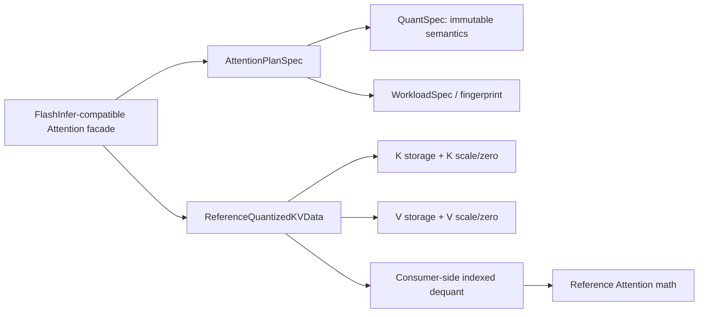

# Attention 量化输入与输出绑定框架设计

> 状态：Host reference contract v0.5
> 日期：2026-08-26
> 范围：定义 Attention 消费量化 KV 及 provider 输出量化参数的框架语义；不包含 NPU kernel

## 1. 目标与边界

当前目标是在保持 FlashInfer Attention public signature 的前提下，为昇腾推理场景增加
可版本化、可调度、可独立验证的量化 KV Cache 契约。它需要先回答四个问题：

1. 量化数据的逻辑 shape 与物理存储 shape 如何对应。
2. scale/zero-point 的 shape 和索引如何从逻辑坐标推导。
3. Attention 在什么位置反量化 K/V。
4. plan、run、workload fingerprint 如何保证使用同一个量化语义。

本阶段不声称支持 CANN、torch_npu、设备级 FP8/NVFP4 编码或执行、MX、设备 swizzle，
也不声称任何 NPU 性能结果。NVFP4 仅建立 `kv_cache_sf` metadata contract；Host logical
FP8 oracle 是 correctness contract，不是生产 fallback。

## 2. 分层模型



- `QuantSpec` 描述 scheme、storage/compute/accumulator dtype、granularity、axis、
  group size、zero-point、packing order 和 physical layout。
- `ReferenceQuantizedTensor` 绑定一个逻辑 tensor 的量化 storage、scale 和可选
  zero-point，并提供按逻辑坐标读取的语义。
- `ReferenceQuantizedKVData` 为 K/V 保留独立的 scale/zero tensor；当前两者要求使用
  相同的 `QuantSpec` 配置，但 scale/zero 数值不共享。
- `AttentionPlanSpec.kv_quant_spec` 进入 `WorkloadSpec.quant_specs`，因此量化与非量化
  plan、以及不同量化粒度的 plan，具有不同 fingerprint。

## 3. 数学语义

对逻辑坐标 `i`：

```text
K(i) = (Kq(i) - Kzero(scale_index(i))) * Kscale(scale_index(i))
V(i) = (Vq(i) - Vzero(scale_index(i))) * Vscale(scale_index(i))
```

对称量化没有 zero-point 时按 `zero = 0` 处理。scale 必须使用
`QuantSpec.scale_dtype`，所有元素必须有限且大于零。显式 zero-point 使用 `int32`，
shape 与 scale 完全相同，且数值必须落入逻辑量化 dtype 的范围。

Reference executor 在读取每个 K/V 元素时反量化，不先物化完整 FP16/BF16 cache。
这冻结了未来 fused consumer kernel 的语义边界。Host 计算使用 Python 浮点数；
`compute_dtype` 和 `accumulator_dtype` 当前属于 plan/dispatch contract，不模拟逐指令舍入。

## 4. 逻辑 shape 与 scale shape

`QuantSpec.axis` 始终引用逻辑 tensor 轴，并允许负轴。scale 轴顺序与 `axis` 声明顺序一致。

- `granularity="tensor"`：`axis=None`，scale shape 为标量 `()`。
- `channel/token/page`：scale shape 为每个声明轴对应的逻辑维度。
- `group/block`：`group_size` 与 `axis` 一一对应，scale 的每一维是
  `ceil(logical_dim / group_size)`；索引是 `logical_index // group_size`。

KV 逻辑 shape：

| Cache | Layout | K logical shape | V logical shape |
| --- | --- | --- | --- |
| Ragged | NHD | `[token, head, qk_dim]` | `[token, head, vo_dim]` |
| Ragged | HND | `[head, token, qk_dim]` | `[head, token, vo_dim]` |
| Paged | NHD | `[page, slot, head, qk_dim]` | `[page, slot, head, vo_dim]` |
| Paged | HND | `[page, head, slot, qk_dim]` | `[page, head, slot, vo_dim]` |

典型 scale 设计：

| 语义 | NHD axis | HND axis | scale shape |
| --- | --- | --- | --- |
| Ragged per-token/head | `(0, 1)` | `(1, 0)` | `[token, head]` |
| Ragged per-token/head/group-D | `(0, 1, 2)` | `(1, 0, 2)` | `[token, head, ceil(D/G)]`，group size 对应 `(1,1,G)` |
| Paged per-page/head | `(0, 2)` | `(0, 1)` | `[page, head]` |
| Paged per-slot/head/group-D | `(0,1,2,3)` | `(0,2,1,3)` | 轴声明顺序对应的 group 网格 |

同一个 K/V `QuantSpec` 可以因 `qk_dim != vo_dim` 推导出不同的末维 scale shape；
这是合法的，因为两者绑定不同的 scale tensor。

## 5. INT8、UINT8、packed INT4 与 logical FP8

当前 Host contract 支持：

| `storage_dtype` | 物理 `ReferenceTensor.dtype` | 逻辑范围 |
| --- | --- | --- |
| `int8` | `int8` | `[-128, 127]` |
| `uint8` | `uint8` | `[0, 255]` |
| `int4_packed` | `uint8` | `[-8, 7]` |
| `uint4_packed` | `uint8` | `[0, 15]` |
| `float8_e4m3fn` | `float8_e4m3fn` | 有限的已解码 FP8 值 |
| `float8_e5m2` | `float8_e5m2` | 有限的已解码 FP8 值 |

INT4 沿逻辑 tensor 的最后一维打包，物理末维为 `ceil(logical_last_dim / 2)`。
`packing_order` 必须是：

- `low_nibble_first`：偶数逻辑元素位于低 4 bit。
- `high_nibble_first`：偶数逻辑元素位于高 4 bit。

有符号 INT4 使用 4-bit two's-complement 解码。逻辑末维为奇数时，最后一个 byte
未使用的 nibble 必须为零；这使 checksum、缓存复用和后续设备 converter 的行为稳定。

Host FP8 oracle 把 `ReferenceTensor` 中的数值视为已经按对应 FP8 格式解码的值，再应用
per-head 或 per-tensor scale；它定义 Attention/scale 语义，不模拟硬件 FP8 舍入、饱和或
异常值编码。

## 6. Public facade 接入

不增加或改写现有 FlashInfer 参数位置：

- single prefill/decode：K、V 传入两个 `ReferenceQuantizedTensor` 即显式选择 Host
  量化 oracle；真实 NPU tensor 路径在相同 K/V 参数位置传入两个
  `AttentionOperatorQuantizedTensorInput`。每个输入显式携带逻辑 shape、storage、scale、
  可选 zero-point 和完整 `QuantSpec`，facade 据此生成一次性 plan，再在内部组合 K/V。
- single prefill 的裸 NPU FP8 Q/K/V 可以沿用上游接口同时传入
  `scale_q`/`scale_k`/`scale_v`。框架把 K/V 与各自 scale canonicalize 为内部 per-head
  `QuantSpec`，调用者不需要构造项目扩展 wrapper。任一缺省 scale 被表示为带 shape、dtype、
  device 和逻辑来源的 virtual unit scale；只有 provider binding 明确证明省略对应 package
  参数等价于 scale=1 时，该 candidate 才能在 bootstrap 阶段通过。
- single decode 的裸 NPU FP8 Q/K/V canonicalize 为内部 per-tensor `QuantSpec`。K/V 使用
  scalar virtual unit scale，`q_scale` 与 `k_scale` 只进入 canonical plan 的 softmax scale，
  `v_scale` 保持为输出倍率。provider 必须证明 K/V scale 参数省略等价于 1，调用者仍不需要
  构造项目扩展 wrapper。
- batch ragged prefill 和 mixed `BatchAttention`：`plan(..., kv_data_type=quant_spec)`；Host run
  传入 `ReferenceQuantizedKVData`。Provider paged/mixed run 的单一 cache 参数传入
  `AttentionOperatorQuantizedKVInput`；ragged run 的分离 K/V 参数分别传入
  `AttentionOperatorQuantizedTensorInput`，由 wrapper 内部组合。
- batch paged prefill/decode 的 NPU provider plan 还接受上游形式的 FP8 `kv_data_type`，并
  自动生成 per-tensor QuantSpec；Host oracle 继续直接读取 logical FP8 `ReferenceTensor`。
  分离的裸 `(K, V)` cache 在内部获得 scalar virtual unit scale；provider 未声明参数省略
  等价于 1 时不能注册。合并 cache 需要经过验证的 slot-view binding，当前不会猜测或切片。
- `kv_cache_sf` 保留上游 NVFP4 含义，已有独立 Host metadata 契约和精确 operation lowering
  binding；binding 同时固定 packed NVFP4 QuantSpec 与 provider-explicit physical layout/packing。
  尚无真实 provider contribution 或执行授权，不能借用该参数表达 INT8/INT4。规则见
  [Attention NVFP4 KV scale-factor 契约](attention_nvfp4_scale_factor.md)。

single facade 不增加公开 plan handle。调用者仍只调用
`single_prefill_with_kv_cache(q, k, v, ...)` 或
`single_decode_with_kv_cache(q, k, v, ...)`；框架从 Q 与量化 K/V 描述生成 plan，按完整
`QuantSpec`、shape、layout 和运行环境选择 provider。逻辑 shape 与实际 storage/scale shape
会在进入外部 callable 前再次闭合验证。

single prefill 的 `scale_q`/`scale_k`/`scale_v` 是上游 FP8 逐头 scale，在内部独立表示为
`run.q_head_scale`/`run.k_head_scale`/`run.v_head_scale`。它们不能与同一公开函数中的
`k_scale`/`v_scale` 校准倍率合并：后两者继续表示为 `run.k_scale`/`run.v_scale`。
batch paged/ragged 的 `q_scale` 则表示为 `run.q_scale`。只有所选 operation 的
`AttentionOperatorQuantizationBinding` 将相应来源精确绑定到 provider 参数时才会注入；
每一项默认独立拒绝。single decode 的标量 `q_scale` 与 `k_scale` 按上游语义相乘后折入
该次 canonical plan 的 softmax scale，不伪造额外 provider quant 参数；`v_scale` 仍是输出
倍率，只有精确的 `run.v_scale` provider 绑定才能承接。非量化 provider 路径仍拒绝这些
尚无独立语义证明的 scale。已授权的逐头 scale 还必须是 contiguous rank-1 tensor，Q 长度等于
`num_qo_heads`，K/V 长度等于 `num_kv_heads`，dtype 等于绑定 `QuantSpec.scale_dtype`，且
device 与 provider query 一致；这些检查先于 package callable。

batch paged prefill/decode 的 plan 可跨多次 run 复用，因此 `q_scale/k_scale/v_scale` 数值不进入
plan fingerprint；它们保持三个独立的运行来源，并由精确 provider binding 承接。缺省值
不注入参数，语义为 1。裸 FP8 cache 的 K/V virtual unit scale 与这三个 calibration 值不是
同一层概念，不能相乘后写回 cache scale。

`AttentionOperatorQuantizationBinding` 还必须为每个已绑定的 `run.q_scale/run.k_scale/`
`run.v_scale/run.o_scale` 声明输入形态。`scalar` 表示有限 Host 标量；`head_tensor` 表示
contiguous rank-1 Tensor，Q 长度为 `num_qo_heads`，K/V 长度为 `num_kv_heads`，dtype 等于
`QuantSpec.scale_dtype`，device 与 provider query 一致。FlashInfer-compatible paged prefill
的 Q/K/V scale 同时开放 `scalar` 和 `head_tensor`；paged decode、single decode、single
prefill 的校准倍率以及 ragged prefill 的 Q/K/V/O scale 只开放 `scalar`。bootstrap 要求候选
provider 覆盖某个 mode 的全部公开形态，run lowering 再按实际值校验形态和元数据；provider
即使支持更宽输入，也不能扩大 public facade 的契约。

裸 FP8 canonicalization 中，`scale_k`/`scale_v` 成为内部 K/V quantized input 自带的
`kv.key.scale`/`kv.value.scale`，不会再次注入 `run.k_head_scale`/`run.v_head_scale`；
`scale_q` 仍作为 `run.q_head_scale`。这避免同一 scale 被 provider 应用两次。
缺省项不会伪造设备地址或在 run 热路径临时分配 tensor：框架验证 virtual unit scale 的
scalar/head shape、float32 dtype 和 device 后，按 `implicit_unit_scale_sources` 省略已获授权的
provider 参数。未声明该语义的 FP8 provider 不能注册为完整 public Attention candidate。

ragged prefill 的公开 `o_scale` 独立建模为 `run.o_scale`。它不是 K/V 反量化 scale，也不能
仅凭 provider 参数名相似就转发。绑定除声明精确 catalog argument 外，还必须列出允许的
`AttentionPlanSpec.o_dtype`；run-time 输出 dtype 不在该集合中时，在外部 package 调用前失败。
这允许 FlashInfer facade 保留同一 `o_scale` 参数，同时区分支持输出缩放/量化的 operation
与必须拒绝该参数的 operation。CANN v2 的 `quant_scale_out` 属于输出量化参数，真实 binding
还必须遵守该版本对输出 dtype、scale dtype 与 shape 的约束。

把 `QuantSpec` 对象作为 `kv_data_type` 是本项目的框架扩展：Python signature 与上游一致，
但运行时类型契约不是 upstream exact parity。未来 Torch frontend 可以增加清晰命名的
量化 cache wrapper；不能把额外语义隐藏在裸字符串 dtype 中。

## 7. Plan/run 一致性

run 必须同时匹配：

- storage dtype；
- 完整 `QuantSpec`；
- KV layout、head count、QK/VO dimension、page size 和设备；
- quantized K/V 的逻辑 shape、storage shape、scale shape 和 zero-point shape。

量化 plan 收到普通 K/V，或普通 plan 收到量化 K/V，必须失败。即使 storage dtype
同为 `int8`，granularity、axis、group size、zero-point 或 packing order 不同也必须失败。

## 8. 验证门禁

量化合同要求覆盖 INT8/UINT8、对称/非对称、per-tensor/per-token/group、INT4 两种
nibble order、奇数 padding、独立 K/V scale，以及 single、ragged、paged 和 mixed
Attention 消费。mixed 语义还必须覆盖 NHD/HND、GQA、共享/重复 page、packed INT4、
asymmetric UINT8 channel scale、per-head runtime K/V scale、sliding window 与
plan/runtime soft-cap，并以显式解量化后的 dense oracle 定义逐元素预期。

量化 corpus 必须覆盖 paged INT4 multi-request/shared-page、groupwise paged
decode/GQA/QK-VO 不同维度，以及以下两类 mixed 联合门禁：

- packed INT4 + 奇数维 + shared/repeated page + window + runtime soft-cap + per-head scale；
- asymmetric UINT8 + per-head channel scale/zero-point + HND + GQA + runtime soft-cap/scale。

`window_left` 属于归一化 `AttentionPlanSpec` 和 executor/backend 的内部契约；上游
`BatchAttention.plan` public signature 当前没有对应参数，因此框架不扩写该公开接口。
window 组合只在内部 plan/reference contract 中验证，避免产生伪 upstream parity。

量化准确度 v1 使用 paired dense/quantized trace 区分量化误差与未来 backend 执行误差，
详见 [`attention_accuracy.md`](attention_accuracy.md)。Accuracy policy 必须区分精确量化、
有损量化、奇数维 packed INT4 和必须拒绝的非有限值或 overflow，不在文档中维护具体
case 清单或执行结果。

进入 Torch/NPU 层前仍需补齐：

1. 扩展更多 scale 极值、累加 dtype、shape/head mapping 的格式化预算矩阵。
2. Torch metadata wrapper 已有协议级验证；真实 Torch/torch_npu 的 stride/device/stream 与 allocator lifetime acceptance。
3. physical layout descriptor/catalog、三组件 shape、conversion plan 与 KV POD/binary ABI v2 已冻结；仍需真实昇腾 descriptor、converter artifact，以及 v2 packet/provider 接线。
4. capability profile v1 已冻结完整 QuantSpec predicate；仍需用真实 SoC/CANN tuple 生成 evidence。
5. accuracy report 必须绑定 launch packet、成功 provider completion、lifecycle trace 与可信 runner attestation。
6. package runtime bootstrap 已要求 capability `QuantSpec` 与 catalog quant arguments 完全闭合；
   真实 CANN/flash-attention-npu binding 仍需逐参数语义与版本证据，不能由参数名称推断。
7. 通用 provider quantized-KV input、run lowering、tensor metadata inspector 与 package
   adapter composition 已接入框架路径，冻结 storage/scale/zero-point/runtime Q/K/V/output
   scale 以及 single-prefill 逐头 Q/K/V scale 的独立来源；仍缺少绑定到精确外部包版本和
   真实昇腾 tensor 的 CANN/flash-attention-npu runtime spec。

需要实际 unit-scale tensor、而不是参数缺省语义的 provider 尚需增加 plan-owned
materialization；NVFP4、MX、真实非逻辑 layout descriptor/converter、K/V 不同
`QuantSpec` 配置和量化 packed combined-KV allocation 仍是显式 gap。
