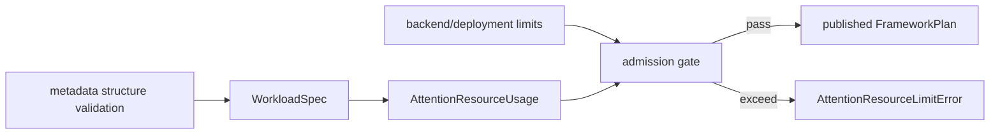

# Attention Metadata 资源 Admission 契约

> 状态：Resource limits v1  
> 日期：2026-08-13  
> 范围：Host plan gate；不依赖 Torch、CANN 或 NPU

## 1. 结构合法不等于资源可接受

CSR 单调、page index 非负和 mask shape 正确，只能证明 metadata 语义合法。一个合法请求仍
可能超过 backend 的 workspace、索引位宽、图捕获容量或部署配额。因此
`AttentionMetadataLimits` 在 `plan()` 发布 plan 之前执行独立 admission：

## 2. v1 计量维度

| Limit | Usage 含义 |
| --- | --- |
| `max_batch_size` | request 数量 |
| `max_total_qo_tokens` | batch 总 query token |
| `max_total_kv_tokens` | batch 各逻辑 KV 长度之和 |
| `max_total_pages` | page table entry 数，不是 unique physical page 数 |
| `max_pages_per_request` | 单请求最大 page entry 数 |
| `max_page_size` | paged KV page size；ragged/single 为 0 |
| `max_qo_tokens_per_request` | 单请求最大 query token |
| `max_kv_tokens_per_request` | 单请求最大逻辑 KV token |
| `max_custom_mask_bytes` | bool/uint8 frontend storage byte 数；packed mask 已按 segment 取整 |

每个字段为非负整数或 `None`。`None` 表示该维度不设限；框架默认使用全 `None`，因为在尚未
验证 SoC/CANN/backend 组合前写入任意“生产上限”会制造虚假支持声明。

## 3. Plan identity

资源 profile 不改变 Attention 数学语义：相同 spec/metadata 在不同 limits 下保持相同
`plan.fingerprint`。审计、graph resource 和缓存隔离使用
`plan.admission_fingerprint = hash(plan fingerprint, limits fingerprint)`。
plan 同时保存实际 `AttentionResourceUsage`，便于后续 workspace formula 和诊断消费。

超限抛出 `AttentionResourceLimitError`（`SchemaError` 子类），并且 session 不增加 generation、
不发布半完成 plan。恰好等于 limit 合法。

## 4. 安全边界

该 gate 在 Python metadata 对象构造之后、任何 proportional tensor/workspace allocation
之前执行。它不能替代外部 JSON/RPC parser 的输入 envelope byte limit；不可信 trace 或
服务请求必须先限制序列化消息大小和数组元素数，再进入本契约。

首个真实 backend profile 必须从固定 SoC、CANN、torch_npu、索引 dtype、workspace formula
和实测边界生成，不允许仅凭设备总内存推断。图模式还应把相同 limits fingerprint 绑定到
capture resource，避免用较宽 profile 的 plan 复用较窄 allocation。
