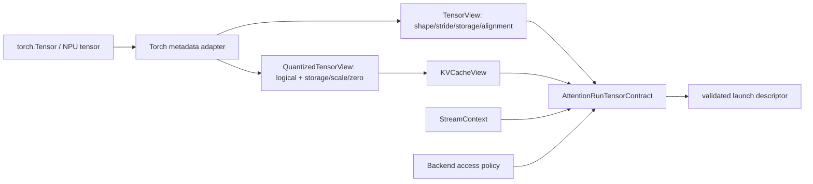

# Attention Tensor View 与执行上下文契约

> 状态：Framework tensor contract v1  
> 日期：2026-08-13  
> 范围：冻结 Torch/torch_npu adapter 的映射目标；可选 Torch adapter 惰性加载，当前不依赖或验证 PyTorch/NPU runtime

## 1. 为什么不能只传 shape/dtype

`TensorSpec(shape, dtype, device)` 足以做 Attention 数学 shape 推导，但不足以安全 launch
真实 backend。设备 frontend 还必须证明：

- stride 指向的所有元素都在 storage bounds 内；
- view 没有 backend 无法处理的内部 overlap 或负 stride；
- storage offset 与实际 data pointer 满足对齐要求；
- output/workspace 可写且不与输入非法 alias；
- K/V storage、scale、zero-point 的逻辑与物理 shape 一致；
- 所有 tensor 与当前 execution stream 属于同一 device；
- backend 的 contiguous 要求是显式 capability，而不是公共 API 的隐含假设。

因此框架增加 `TensorView`、`QuantizedTensorView`、`KVCacheView`、`StreamContext` 和
`AttentionRunTensorContract`，同时保留原有 `TensorSpec` 作为纯语义层。



## 2. TensorView v1

字段：

| 字段 | 单位/含义 |
| --- | --- |
| `shape` | 逻辑元素维度 |
| `strides` | element stride，不是 byte stride |
| `dtype` | 版本化 dtype 名称 |
| `device` | backend-neutral device 标识 |
| `storage_id` | 单次 run 内的 opaque alias identity；不是指针值 |
| `storage_nbytes` | 底层 allocation 总 byte 数 |
| `storage_offset` | element offset |
| `data_ptr_alignment` | actual view data pointer 已知对齐，byte |
| `writable` | backend 是否可写该 view |

构造时计算最大 element offset 和 required storage bytes，越界立即失败。零元素 view
允许 offset 位于 allocation 末端。v1 支持 contiguous、transpose 和有间隔的正 stride
view；拒绝负 stride 与内部 overlap。

`storage_id` 只表达同一次调用中的 alias 关系。它可以进入诊断信息，但不能跨进程持久化
真实地址，也不能作为 workload/trace identity。Reference adapter 使用进程内对象 identity
的不可逆摘要。

## 3. Stride 与 backend policy 分离

框架语义不强制 Q/K/V/O contiguous。`AttentionTensorAccessPolicy` 由具体 backend 声明：

```text
require_contiguous_q
require_contiguous_kv
require_contiguous_output
required_alignment
permit_output_input_alias
```

例如 future aclnn adapter 可以接受某类 stride，而 Ascend C optimized kernel 可以要求
16/32-byte alignment 和 contiguous last dimension。两者必须在 capability/dispatch 中可见，
不能由 adapter 静默 `.contiguous()`；需要 materialization 时应产生显式转换 plan、额外
workspace 和 trace event。

Package provider 的 bootstrap 直接绑定一份 `AttentionTensorAccessPolicy` 和 metadata-only
inspector。通用 run adapter 始终闭合 Q 的 mode-specific shape、计划 dtype 与 provider device；
只有当 policy 的 `require_contiguous_q` 为真时才拒绝非连续 Q，并按 `required_alignment`
检查地址对齐。可选 caller-owned `out`/`lse` 同时验证 shape、dtype、device、writable、alignment
和 alias；`require_contiguous_output` 约束 `out`。operation/resource binding 只有在 catalog
明确给出 mutable buffer argument 后才允许并注入该对象。该 adapter 不访问 tensor 内容，也不
创建替代 tensor。KV 与 workspace 继续由各自的量化和 resource binding 负责；对应
access-policy 字段必须在这些边界接通后才能宣称生效。

## 4. 量化 view

`QuantizedTensorView` 包含：

- `logical_shape`；
- physical storage `TensorView`；
- scale `TensorView`；
- 可选 int32 zero-point `TensorView`；
- 完整 `QuantSpec`。

storage shape 和 scale shape 调用与 Host reference 相同的
`infer_quant_storage_shape()`/`infer_quant_scale_shape()`，从而保证 reference、Torch adapter
和 backend descriptor 不复制量化寻址规则。

当前规则包括：

- INT8/UINT8 storage shape 等于 logical shape；
- packed INT4 physical last dimension 为 `ceil(D/2)`；
- tensor/token/channel/page/group/block scale shape；
- asymmetric zero-point 与 scale shape 相同、dtype 为 int32；
- storage、scale、zero-point 同 device 且互不 alias；
- 非逻辑 physical layout 必须携带已注册 descriptor；storage/scale/zero shape、padding 与 alignment
  由 [`attention_quant_physical_layout.md`](attention_quant_physical_layout.md) 推导，不能猜测。

## 5. KVCacheView

`KVCacheView` 同时携带 `PagedKVCacheSpec`/`RaggedKVCacheSpec`，因此构造阶段检查：

- NHD/HND 对应的 K/V logical shape；
- packed 或 separate allocation 结构；
- cache dtype、device 与 QuantSpec；
- dense cache 不能伪装成 quantized cache；
- separate K/V 不能 alias；
- quantized K/V 使用同一个 `QuantSpec` 配置。

Combined packed dense KV 用单一 physical view 表达，避免把同一 allocation 粗暴拆成两个
span 后产生错误 alias 判断。Quantized KV 当前只允许 separate K/V，以保留独立 scale/zero。

## 6. Alias 与 writable 规则

默认 Attention v1：

| 组合 | 规则 |
| --- | --- |
| Q/K/V 之间 | separate allocation 不可 overlap |
| K/V 与各自 scale/zero | 不可 overlap |
| out/LSE | 必须 writable，彼此不可 overlap |
| out/LSE 与 Q/K/V | 默认不可 overlap |
| float/int workspace | 必须同时提供、writable、彼此不 overlap |
| workspace 与所有 tensor | 不可 overlap |

同一 storage 的 alias 检查使用 view 的 byte span，属于保守 launch gate：无法证明 disjoint
时拒绝。未来 runtime adapter 若能获得更强的 non-overlap 证明，可以将其编码为
经验证的独立 alias region，不能简单忽略检查。

## 7. Device 与 stream

`StreamContext(device, stream_id, ordered)` 是 execution context，而不是 tensor 属性的替代：

- 所有 run view 必须在 stream device 上；
- v1 只接受 ordered stream；
- Host reference 使用 `host-synchronous`；
- 未来 torch_npu adapter 必须读取 current NPU stream，不得隐式切换 default stream；
- workspace lease 和 plan auxiliary buffer 的完成事件必须绑定同一 stream context；
- 跨 stream 复用必须有显式 event dependency。

本契约不执行同步，也不声称已经验证 torch_npu stream；它只冻结 adapter 必须提供的信息。

## 8. 与 plan/run 的组合

`AttentionRunTensorContract.validate(policy, plan)` 分两层验证：

1. storage/access：stride、bounds、alignment、alias、writable、device/stream。
2. semantic plan：Q/KV/out/LSE shape、dtype、layout、quant spec、metadata capacity。

现有 batch prefill/decode 和 mixed `BatchAttention` Host facade 已接入这条路径；single
facade 仍由相同 reference tensor 构造器和 plan validator覆盖，后续统一 Torch adapter 时
共享此 contract。

## 9. Torch/torch_npu adapter 门禁

`TorchTensorViewAdapter` 当前只定义协议适配边界；实现真实 runtime adapter 前仍必须逐项验证：

1. `tensor.shape/stride()/storage_offset()/element_size()` 映射无单位错误。
2. storage byte capacity 来自可靠 runtime API，而不是 `numel * itemsize` 猜测。
3. storage identity 是 opaque token，不在日志/trace 泄露 raw pointer。
4. view pointer alignment 直接读取实际 `tensor.data_ptr()`，不假设它与 storage pointer 的算术关系。
5. `requires_grad`、autograd view、conjugate/negative bit 等推理不支持状态明确拒绝。
6. output `out` 的 writable、resize、alias 和 lifetime 规则冻结。
7. quantized storage/scale/zero device、stride 和 layout 全部独立检查。
8. current stream、device guard、异步错误和 record-stream lifetime 具有可复核证据。
9. `.contiguous()`、dtype cast、layout transform 均为显式 operation，不在 adapter 内隐藏。
10. CPU Host oracle 与 Torch CPU functional executor 对同一 corpus 结果一致后，才进入 torch_npu functional。

当前 KV POD v1 尚无 layout descriptor fingerprint，因此即使 tensor view 通过非逻辑布局验证，
launch materialization 仍会明确拒绝；必须通过版本化 ABI 扩展接入，不能只靠物理 shape 猜测。

具体映射、拒绝路径、stream/lifetime 边界和验收顺序见
[`attention_torch_adapter.md`](attention_torch_adapter.md)。
