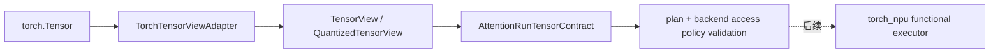

# Attention Torch 元数据适配器

> 文档状态：Protocol-conformant adapter v1
> 适配边界：只定义 metadata 协议；不声明真实 PyTorch/torch_npu 运行时支持

## 1. 定位

`TorchTensorViewAdapter` 是 Torch tensor 与框架无关 Attention tensor contract 之间的薄层：

它只读取 metadata，不执行 Attention、不搬运数据，也不选择 kernel。模块导入本身不导入
`torch`；只有使用默认构造器时才惰性解析 `torch.Tensor`。因此 Host-only 安装仍保持零第三方依赖。

## 2. Torch metadata 映射

| Torch metadata | Framework field | 约束 |
| --- | --- | --- |
| `shape` | `TensorView.shape` | element 维度 |
| `stride()` | `TensorView.strides` | element stride；原样保留，不调用 `.contiguous()` |
| `storage_offset()` | `TensorView.storage_offset` | element offset |
| `element_size()` | dtype 一致性检查 | 必须与规范化 dtype 的 byte size 相同 |
| `untyped_storage().nbytes()` | `storage_nbytes` | allocation capacity；不以 `numel * itemsize` 猜测 |
| `untyped_storage().data_ptr()` | opaque `storage_id` 输入 | 只用于单次 run alias identity，输出不可逆摘要 |
| `data_ptr()` | `data_ptr_alignment` | actual view pointer 的 byte alignment |
| `device` | view/stream device | 所有 run tensor 必须一致 |

PyTorch 官方说明 tensor 与 storage 可以共享，同时不保证 `Tensor.data_ptr()` 等于
`UntypedStorage.data_ptr()` 加 `storage_offset`。因此 adapter 不从 storage pointer 推导 view
pointer；两者分别只承担 alias identity 与实际对齐检查。依据见
[PyTorch Storage 文档](https://docs.pytorch.org/docs/stable/storage.html)、
[`Tensor.untyped_storage`](https://docs.pytorch.org/docs/stable/generated/torch.Tensor.untyped_storage.html)
和 [Tensor stride/storage_offset 文档](https://docs.pytorch.org/docs/stable/tensors.html)。

## 3. 明确拒绝与不做的事情

adapter 在构造 launch contract 前拒绝：

- 非 `torch.strided` layout、meta tensor、sparse/nested tensor；
- `requires_grad=True`、conjugate bit、negative bit；
- Torch native quantized tensor；量化 KV 必须显式给出 storage/scale/zero-point；
- dtype 与 `element_size()` 不一致、storage bounds 越界、内部 overlap 或负 stride；
- accelerator tensor 未提供 current-stream resolver；
- output/workspace 不可写、非法 alias、device/plan 语义不一致。

adapter 不会隐藏调用 `.contiguous()`、cast、layout conversion、resize、device copy 或 stream
同步。未来确需物化时，必须成为可观察的 plan operation，并计入 workspace、trace 与性能。

## 4. Dense 与量化 KV

- Dense separate KV：`(K, V)` 两个 tensor。
- Dense packed KV：单个 physical tensor，K/V 共享一个受控 packed view。
- Quantized separate KV：两个 `TorchQuantizedTensorInput`；每个包含 logical shape、physical
  storage、scale、可选 zero-point 和 `QuantSpec`。
- Quantized packed KV：v1 不接受，避免在 scale/zero layout 尚未冻结时猜测物理布局。

storage/scale/zero-point 分别建立 `TensorView`，随后复用 Host reference 的
`infer_quant_storage_shape()` 与 `infer_quant_scale_shape()` 做同一套 shape 证明。

## 5. Stream 与 lifetime 边界

CPU 映射为同步的 `torch-cpu-synchronous` context。任何非 CPU device 都必须显式注入
current-stream resolver；通用 adapter 不猜测 CUDA 或 NPU default stream。

当前只冻结 stream identity。真实 `torch_npu` adapter 进入前仍需验证：

1. 当前 NPU stream 的获取及 device guard；
2. allocator lifetime 与跨 stream 使用；
3. 是否以及何时调用类似
   [`Tensor.record_stream`](https://docs.pytorch.org/docs/stable/generated/torch.Tensor.record_stream.html)
   的机制；
4. 异步错误归属与 workspace completion event。

## 6. Metadata 合同与运行时门禁

metadata-only 合同包括 lazy dependency failure、stride/offset/capacity、
opaque storage alias、非连续 view、storage bounds、CPU/accelerator stream 边界、dense/packed
KV、显式 INT8 KV、writable output 与非法 alias。

该协议不能代替真实 Torch 运行时证据。进入 `torch_npu functional` 前必须依次完成：

1. 官方支持版本的真实 Torch CPU tensor metadata acceptance；
2. Torch CPU functional executor 对同一 Attention corpus 与 Host oracle 数值对拍；
3. 固定 PyTorch/torch_npu/CANN/driver/firmware/SoC tuple；
4. 真实 NPU view、stream、allocator lifetime 与错误路径验证；
5. parity 状态从 `reference` 升为 `functional`，而不是只因 adapter 存在而升级。
