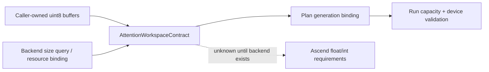
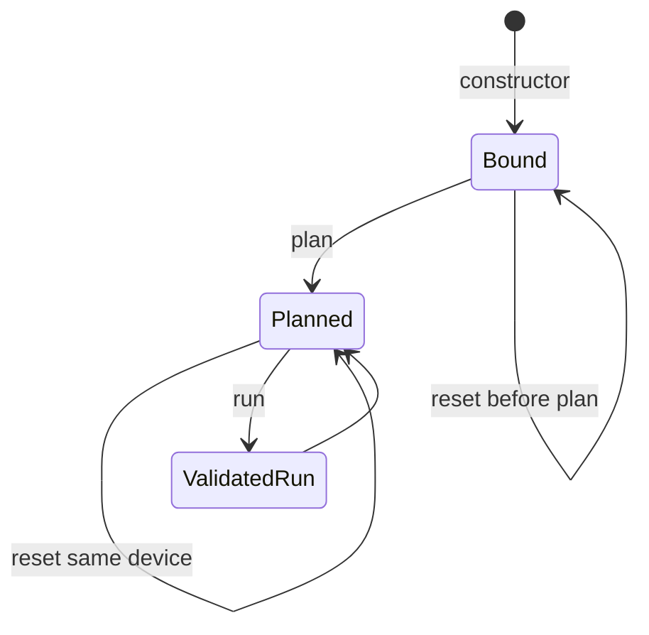

# Attention Workspace 资源契约

> 状态：Host workspace contract v1  
> 日期：2026-08-20  
> 范围：caller-owned workspace 的容量、查询与生命周期；不推测 Ascend kernel scratch

## 1. 核心原则

Workspace 必须区分两个值：

- **capacity**：调用者当前绑定的 byte buffer 容量。
- **required size**：具体 backend 对某个 plan 所需的容量。

未知 requirement 使用 `None`，不能解释为零。Host scalar reference 因为确实不使用
scratch，可以报告 `(required_float_bytes, required_int_bytes) = (0, 0)`。外部 package
operation 若签名中不接收 wrapper workspace，也可以把“调用者提供的 workspace”需求绑定为
`(0, 0)`；这只表示 workspace 由 package 管理，不表示 package 或底层算子没有内部 scratch。

## 2. Contract 字段

`AttentionWorkspaceContract` 记录：

- backend 和 device；
- float/int buffer 的实际 byte capacity；
- float/int required bytes，必须同时已知或同时未知；
- `binding_generation`：每次 reset 增加；
- `plan_generation`：当前 binding 关联的 framework plan；
- graph-enabled 标志和独立 schema version。

Workspace capacity 不进入 Attention 数学 workload fingerprint，因为更换更大的 caller buffer
不应改变算子语义；它有自己的 resource fingerprint。

## 3. 生命周期

- `plan()` 将 workspace binding 关联到 plan generation。
- `reset_workspace_buffer()` 更换 buffer 并增加 binding generation，不修改 cached plan。
- plan 后或 graph resource 已绑定后不能改变 device。
- float/int buffer 不能 alias。
- run 校验 capacity、query device 和 active plan generation。
- Host reference 同步执行，因此 reset 后可以立即复用 plan。非 reference 提交使用
  `AttentionLaunchLeaseContract`/`AttentionLeaseRegistry` 的 acquired→submitted→completed 状态，
  在拥有该提交的 completion event 到达前禁止释放或覆盖 workspace。
- graph-enabled wrapper 已发布 structural capture record 后，reset 会改变 workspace resource
  fingerprint；下一次 run 明确拒绝旧 record。调用者须 re-plan 后再建立新 record。

## 4. `workspace_size()` 对标语义

当前上游 paged prefill 和 paged decode wrapper 都提供只读 size query，输入与 `plan()`
基本一致，并明确不分配、不改变 cached plan：

- [FlashInfer paged prefill source](https://github.com/flashinfer-ai/flashinfer/blob/main/flashinfer/prefill.py)
- [FlashInfer paged decode source](https://github.com/flashinfer-ai/flashinfer/blob/main/flashinfer/decode.py)

本项目对应两个 public facade 保持 snapshot signature，并通过临时 Host planning context 执行
与 `plan()` 相同的 metadata/spec 校验。返回 `(0, 0)` 只代表显式选择的 reference backend。
Provider 的非变异 `workspace_size()` 仍要求独立的 package size-query binding；active plan
中的 package-managed resource binding 不能替代该查询。

## 5. Provider resource binding

每个已选择的 provider operation 在 active plan 发布前生成
`AttentionOperatorResourceBinding`。它固定：

- operation 与 active-plan fingerprint；
- workspace 是 `package_managed` 还是 `caller_managed`；
- wrapper float/int workspace 的精确需求；
- output 与 LSE 是返回值还是 caller-owned mutable argument。

当前 catalog 中的 CANN 与 flash-attention-npu Python API 都返回 output/LSE，且没有 wrapper
workspace 参数，因此绑定为 `package_managed + returned`。wrapper workspace 的调用侧需求为
零并绑定到 plan generation；query device、capacity 和 generation 仍在每次 `run()` 前校验。
当前 operation 也没有 caller-owned `out/lse` mutable argument，所以对应 public 参数必须在
package invocation 前失败，不能假定返回 tensor 可以安全复制或复用为调用者 buffer。

## 6. Graph metadata 与 scratch 分离

`qo_indptr_buf`、page indptr/indices/last-page-len、custom-mask buffer 等 graph 固定容量是
持久 metadata resource，不计入 float/int kernel scratch：

| 资源 | 生命周期 | 当前校验 |
| --- | --- | --- |
| Float scratch | wrapper binding | rank-1 uint8、capacity、device |
| Int scratch | wrapper binding | rank-1 uint8、capacity、device、no alias |
| Graph indptr/length | wrapper lifetime | dtype、固定 batch length |
| Graph page indices | wrapper lifetime | 最大引用数量 |
| Graph mask | wrapper lifetime | packed byte capacity |
| Backend auxiliary plan | plan lifetime | 后续 descriptor 定义 |

## 7. Ascend backend 接入门禁

任何使用 caller-managed workspace 的 Ascend backend descriptor 必须提供或查询：

1. float/int required bytes，不能沿用 reference 的零值。
2. byte alignment 和地址 alignment。
3. requirement 所依赖的 workload dimension、quant spec 和 algorithm variant。
4. plan auxiliary data 位于 Host、device 或 pinned memory 的 ownership。
5. stream 并发时 workspace 是否可共享；默认按 stream 独占。
6. reset 时在飞行 kernel 的同步/事件要求。
7. capacity 不足时在 launch 前失败，禁止运行中扩容或隐式分配。

在这些信息由真实 backend 提供前，caller-managed 路径保持
`requirements_known=False`，访问 required sizes 会抛出
`WorkspaceRequirementUnknownError`。Package-managed 路径必须由精确 operation signature
证明 wrapper workspace 不会作为参数传入，不能仅凭适配器实现习惯推断。

`KernelDescriptor.workspace` 与 `KernelDescriptor.int_workspace` 分别描述 float/int
workspace formula。Dispatch receipt 固定两者各自的 required bytes 和 alignment；execution
identity builder 要求它们与 `AttentionWorkspaceContract` 及实际 TensorView 分别精确匹配，
禁止只比较总字节数。详见
[`attention_dispatch_receipt.md`](attention_dispatch_receipt.md)。

Workspace、持久 graph metadata、tensor ABI 与 plan 的联合复用规则见
[`attention_execution_identity.md`](attention_execution_identity.md)。
具体地址、allocation generation、stream 和 completion event 规则见
[`attention_launcher_abi.md`](attention_launcher_abi.md)。
